# 27. 다중 개발 서버 구축 가이드

## 0. 먼저 알고 가기 (30초 요약)

- 다중 환경은 공유 자원 경합을 줄이는 운영 규칙에서 출발합니다.
- PR/브랜치마다 고유한 라우팅과 접근 권한을 고정해 둡니다.
- 사용 종료 시 클린업 규칙을 자동화하면 비용과 혼선을 줄일 수 있습니다.

## 초심자용 한눈에 보기

여러 환경 배포는 “동시에 돌려도 서로 간섭하지 않게” 운영 순서를 고정하는 게 핵심입니다.

> **일상 비유**: 다중 개발 서버는 호텔 운영과 비슷합니다. 같은 건물(인프라)에 여러 객실(환경)이 있고, 손님(PR/branch)마다 별도 룸(URL)이 배정됩니다. 체크인(배포)과 체크아웃(cleanup)이 자동이어야 하고, 청소(권한 분리) 없이 다음 손님이 들어오면 안 됩니다.

### 핵심 용어 빠르게 정리

| 용어            | 쉬운 뜻                              |
| --------------- | ------------------------------------ |
| `preview`       | PR/브랜치 별 임시 배포 주소          |
| `멀티 환경`     | dev/stg/prod처럼 배포 대상 환경 분리 |
| `클린업`        | 불필요한 임시 환경/리소스 제거       |
| `도메인 라우팅` | 어떤 URL이 어떤 환경으로 가는지 설정 |
| `권한 분리`     | 환경별 접근 범위를 나눠 권한을 제한  |

### 환경 계층 한눈에 보기

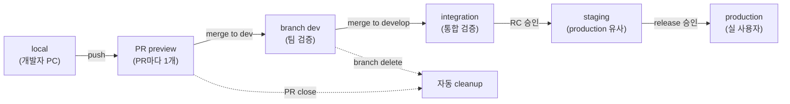

| 분류            | 인프라 & 배포                                                                                                                                                                                                         | 상태          | Stable                     |
| :-------------- | :-------------------------------------------------------------------------------------------------------------------------------------------------------------------------------------------------------------------- | :------------ | :------------------------- |
| **연관 가이드** | [10. 인프라](./10_인프라_IaC_가이드.md), [11. CI/CD](./11_CICD_파이프라인_표준.md), [12. CDN 캐시](./12_CDN_캐시_전략.md), [14. 배포](./14_배포_프로세스_체크리스트.md), [22. 모노레포](./22_모노레포_운영_가이드.md) | **도구 원칙** | AWS 예시, 원칙은 벤더 중립 |
| **핵심 테마**   | Multi-Environment, PR preview, branch deploy, Amplify Hosting, S3 artifact, GitHub Actions, OIDC, rollback                                                                                                            | **Update**    | 공식 문서 기준             |

---

> 다중 개발 서버는 "개발 서버를 많이 만드는 것"이 아니라 **PR, branch, staging, production의 검증 목적을 분리하고, 검증된 artifact를 안전하게 공유·승격·폐기하는 운영 체계**입니다.

---

## 추천 항목 (실무 우선순위)

- **시작 추천**: 환경별 도메인/라우팅 매핑표를 먼저 만들고 preview 주소를 일원화하세요.
- **안정 추천**: 브랜치·PR 빌드 자원은 TTL/자동 정리 정책으로 비용 누수를 막습니다.
- **운영 추천**: 배포 실패 시 공유 artifact 기반으로 재배포/롤백을 표준 절차화하세요.

## 추천 항목 고도화 체크

- `첫 적용` — preview, staging, production 환경과 cleanup 중 하나를 실제 PR이나 운영 이슈에 붙이고, 변경 전 기준을 먼저 적는다.
- `증거 정리` — preview URL, OIDC role, deployment log, cleanup dry-run를 같은 작업 기록에 남긴다.
- `재점검` — orphan 환경, preview 비용, smoke failure, branch drift가 나아졌는지 30일 안에 확인하고 기준을 유지, 수정, 폐기 중 하나로 판정한다.

## 추천 항목 실행 기록 템플릿

- `작업` : preview, staging, production 환경과 cleanup 적용 범위를 어느 화면, 패키지, 문서에 둘지 적는다.
- `증거` : preview URL, OIDC role, deployment log, cleanup dry-run 중 실제로 남긴 항목만 링크한다.
- `판정` : 유지/수정/폐기 중 하나와 이유를 한 문장으로 남긴다.
- `다음 점검` : orphan 환경, preview 비용, smoke failure, branch drift를 다시 볼 날짜와 담당자를 지정한다.

## 문서 책임 범위

| 이 문서가 결정하는 것                                           | 단일 출처로 따르는 문서                                                                  |
| :-------------------------------------------------------------- | :--------------------------------------------------------------------------------------- |
| 개발·검증·preview·staging·production 환경 모델                  | [10. 인프라](./10_인프라_IaC_가이드.md), [14. 배포](./14_배포_프로세스_체크리스트.md)    |
| GitHub Actions로 build, artifact, deploy, smoke를 연결하는 방식 | [11. CI/CD](./11_CICD_파이프라인_표준.md), [07. 테스팅](./07_테스팅_가이드.md)           |
| Amplify Hosting, S3, CloudFront를 이용한 프론트엔드 배포 예시   | [12. CDN 캐시](./12_CDN_캐시_전략.md), [08. 성능](./08_성능_최적화_가이드.md)            |
| OIDC, 장기 키 금지, preview 접근 제어                           | [06. 보안](./06_웹_보안_심화_가이드.md), [16. 코드리뷰](./16_AI_협업_코드리뷰_가이드.md) |

---

## 0. 모든 프론트엔드 그룹 공통 Baseline

| 영역               | 공통 기준                                                                      | 검증 방법                              |
| :----------------- | :----------------------------------------------------------------------------- | :------------------------------------- |
| **환경 목적 분리** | local, PR preview, branch dev, staging, production의 데이터·도메인·권한을 분리 | 환경 매트릭스, domain map              |
| **고유 URL**       | PR/branch별 공유 가능한 URL을 생성하고 PR에 연결                               | preview URL comment, deployment record |
| **검증 후 배포**   | lint/type/test/build/security를 통과한 artifact만 배포                         | CI required checks                     |
| **임시 권한**      | GitHub Actions는 OIDC로 AWS 역할을 AssumeRole                                  | `id-token: write`, trust policy        |
| **자동 정리**      | PR close, branch delete, TTL 만료 시 preview를 삭제 또는 접근 차단             | cleanup workflow, orphan report        |
| **캐시 계약**      | HTML은 짧게, hash asset은 길게, rollback 시 entry와 cache purge를 함께 처리    | `Cache-Control`, invalidation log      |
| **비밀 보호**      | client bundle에 secret을 넣지 않고 public runtime config와 secret을 분리       | secret scan, bundle grep               |

### 0.0 다중 서버 배포 흐름

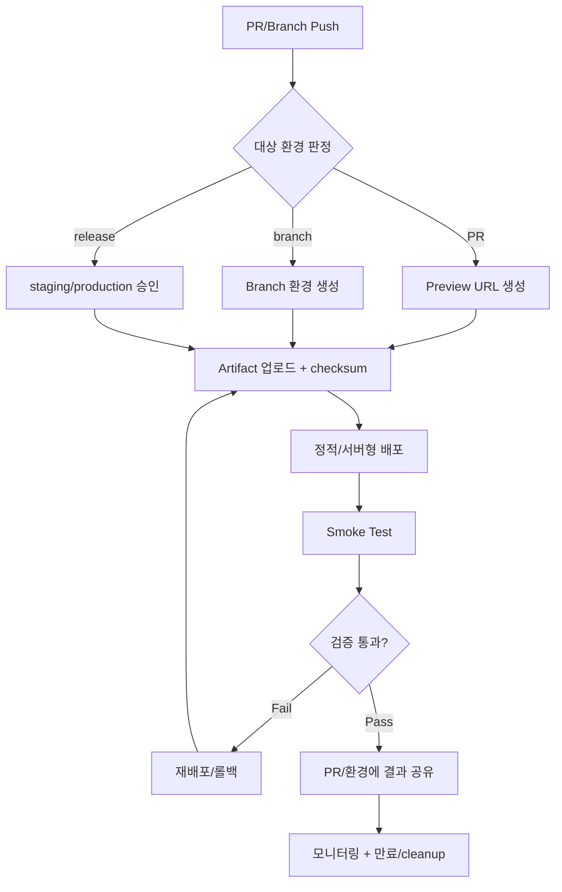

### 0.1 교차 검증 매트릭스

| 권고                                         | 1차 출처                                     | 실행 증거                                     | 운영 증거                        | 철회 조건                                                       |
| :------------------------------------------- | :------------------------------------------- | :-------------------------------------------- | :------------------------------- | :-------------------------------------------------------------- |
| PR preview는 고유 URL을 가진다               | Amplify Web previews, GitHub Deployments     | PR deployment URL, smoke result               | QA lead time, review defect 감소 | quota 초과 또는 보안 위험 시 branch preview로 축소              |
| branch pattern은 자동 생성/삭제된다          | Amplify branch autodetection                 | branch pattern 설정, cleanup log              | orphan branch count              | 자동 삭제가 실패하면 TTL cleanup workflow 추가                  |
| CI는 장기 AWS key를 저장하지 않는다          | GitHub OIDC for AWS, aws-actions credentials | OIDC role assumption log                      | leaked key inventory 감소        | 예외는 만료일 있는 ADR 필요                                     |
| static export는 정적 hosting에만 사용한다    | Next.js static export                        | `output: 'export'`, unsupported feature check | SSR/API route 장애 없음          | SSR, API Routes, Middleware 필요 시 compute/runtime 배포로 전환 |
| S3 artifact는 checksum과 release id를 가진다 | S3 sync, Amplify start-deployment            | artifact path, checksum, source revision      | rollback 성공률                  | artifact 재사용이 불가능하면 build once 원칙 위반으로 중단      |

### 0.2 운영 게이트

| Gate                  | Evidence                                                   | Owner           | Rollback                                 |
| :-------------------- | :--------------------------------------------------------- | :-------------- | :--------------------------------------- |
| 환경 생성             | environment matrix, DNS/URL, access policy                 | Platform owner  | preview 삭제 또는 domain detach          |
| PR preview deploy     | CI run, preview URL, smoke result                          | Feature owner   | preview redeploy 또는 PR block           |
| branch/staging deploy | artifact checksum, deployment record, environment approval | Release owner   | 이전 artifact redeploy                   |
| production release    | approval, canary health, rollback path                     | Release manager | flag off, artifact rollback, cache purge |
| cleanup               | PR close event, branch delete event, TTL report            | Infra owner     | orphan resource 수동 삭제 후 자동화 보강 |

### 0.3 공개 자료와 경험 기반 해석

공개 문서로 확인할 수 있는 것은 AWS Amplify Hosting의 PR preview, pattern-based branch deployment, S3 기반 manual deployment, GitHub Actions의 environment/concurrency/OIDC, Next.js의 static export와 SSR 지원 범위입니다. 특정 조직의 내부 계정 구조, 권한 정책, 도메인 이름, 배포 승인 흐름은 외부에서 검증할 수 없으므로 단정하지 않습니다.

이 가이드는 경험적으로 좋았던 "PR마다 빠르게 볼 수 있는 URL", "검증된 artifact만 승격", "개발자가 AWS 콘솔을 열지 않아도 되는 흐름", "닫힌 PR의 환경 자동 정리"를 재현 가능한 reference architecture로 정리합니다.

### 0.4 AWS 서비스별 책임 매핑

AWS에서 다중 개발 서버를 만들 때 가장 흔한 실패는 Amplify, S3, CloudFront, Route 53, GitHub Actions가 서로 어떤 책임을 갖는지 정하지 않은 채 섞는 것입니다. 아래 표를 먼저 고정하고 구현합니다.

| 서비스             | 맡길 책임                                                                                        | 맡기지 않을 책임                                                 |
| :----------------- | :----------------------------------------------------------------------------------------------- | :--------------------------------------------------------------- |
| Amplify Hosting    | Git branch/PR preview, managed SSR/SSG hosting, branch access control, custom domain association | GitHub Actions 품질 게이트 전체, artifact provenance의 단일 출처 |
| S3 artifact bucket | build output 보관, checksum 기준 rollback source, preview prefix 저장                            | production public serving 직접 노출                              |
| CloudFront         | 정적 앱 CDN, OAC 기반 S3 origin 보호, cache behavior, invalidation                               | SSR compute 실행                                                 |
| Route 53           | preview/staging/production subdomain, Amplify automatic subdomain, CloudFront alias              | 환경별 권한 판단                                                 |
| ACM                | custom domain TLS certificate                                                                    | branch/PR 수명 관리                                              |
| IAM + STS          | GitHub OIDC role assumption, environment별 최소 권한                                             | 장기 access key 운영                                             |
| GitHub Actions     | install/test/build/artifact/deploy/smoke/comment/cleanup orchestration                           | AWS 리소스의 최종 소유권                                         |
| CloudWatch         | Amplify/SSR/runtime log와 alarm                                                                  | PR별 검증 결과의 유일한 기록                                     |

### 0.5 AWS 구축 순서 요약

아래 순서대로 진행하면 콘솔에서 임의로 만든 preview와 IaC로 만든 환경이 섞이는 문제를 줄일 수 있습니다.

1. **환경 이름을 고정합니다**: `preview`, `branch-dev`, `integration`, `staging`, `production`.
2. **도메인 전략을 정합니다**: Amplify managed URL만 쓸지, `pr-123.preview.example.com` 같은 Route 53 subdomain을 쓸지 선택합니다.
3. **앱 유형을 판정합니다**: static export인지, Amplify Hosting compute가 필요한 Next.js SSR인지, container/runtime server가 필요한지 결정합니다.
4. **artifact 단일 출처를 정합니다**: GitHub Actions artifact, S3 prefix, Amplify Git build 중 하나를 release evidence로 삼습니다.
5. **OIDC 역할을 나눕니다**: preview/staging/production role을 분리하고 GitHub environment claim으로 제한합니다.
6. **PR preview 배포를 붙입니다**: URL, revision, smoke result, expiry를 PR에 남깁니다.
7. **cleanup부터 자동화합니다**: PR close와 schedule cleanup을 첫 버전부터 넣습니다.
8. **운영 증거를 남깁니다**: deployment record, checksum, CloudFront invalidation id, cleanup dry-run 결과를 저장합니다.

---

## 1. 목표 아키텍처

> **왜 중요한가**: 다중 환경 구축은 "기능을 보여주는 URL"이 아니라 "검증된 artifact를 안전하게 승격하는 흐름"을 설계하는 일입니다. URL만 만들고 권한·정리·롤백을 미루면 비용과 사고가 같이 쌓입니다.
>
> **일상 비유**: 화물 운송에 비유하면, GitHub Actions가 포장(빌드)과 품질 검사(테스트)를 담당하고, S3가 창고(artifact)에 패키지를 보관하며, Amplify/CloudFront가 배송 트럭(전달)을 맡습니다. 각자가 자기 일만 해야 사고가 줄어듭니다.

### PR Preview 라이프사이클

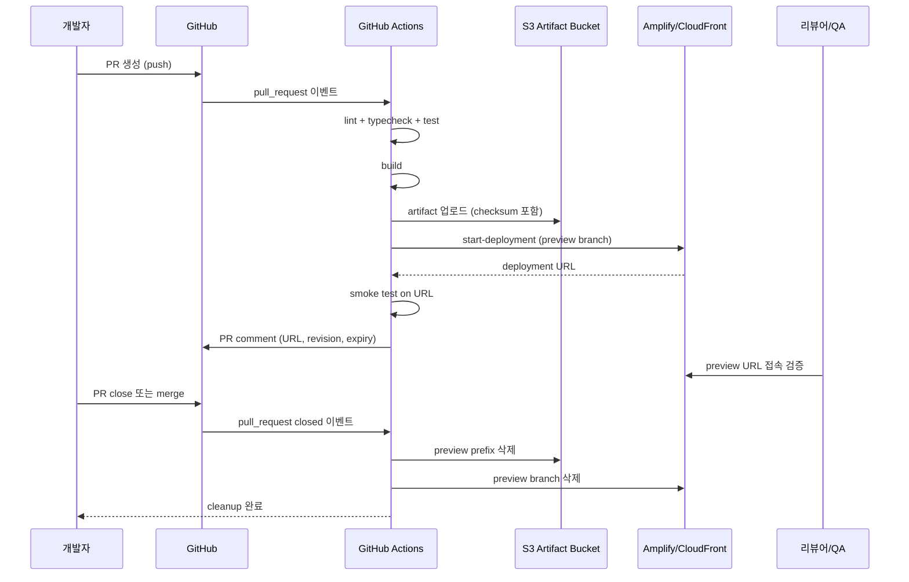

### 1.1 전체 흐름

```text
developer push
  -> GitHub Actions
      -> install / lint / type / test / build
      -> artifact upload with checksum
      -> deploy preview or branch environment
      -> smoke test against deployed URL
      -> comment deployment URL to PR
  -> reviewer / QA validation
  -> merge
  -> staging deploy
  -> production approval
  -> production deploy or release flag on
```

Amplify를 Git provider와 직접 연결하면 branch/PR preview를 빠르게 얻을 수 있습니다. GitHub Actions를 앞단 orchestrator로 두면 품질 게이트, OIDC, artifact provenance, smoke test, 승인 정책을 더 세밀하게 통제할 수 있습니다. S3는 static output 또는 deploy bundle의 artifact registry 역할을 맡습니다.

### 1.2 환경 계층

> **일상 비유**: 환경 계층은 영화 제작 단계와 같습니다. 로컬은 콘티 스케치, PR preview는 스토리보드 시연, integration은 리허설, staging은 시사회, production은 정식 개봉입니다. 각 단계에서 다른 사람이 보고, 다른 기준으로 통과시킵니다.

이 그림은 한 코드 변경이 환경 계층을 어떻게 타고 올라가며, 각 환경이 무엇을 공유/격리하는지를 보여줍니다.

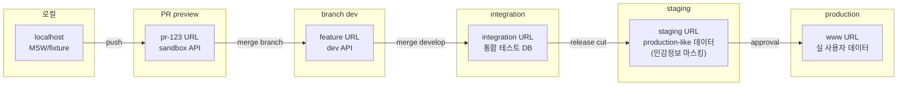

> **격리 원칙**: production secret과 production 쓰기 권한은 staging 이하에 절대 전달하지 않습니다. preview/branch는 mock 또는 sandbox만 사용합니다. 환경 수명은 트리거에 묶입니다 — PR이 닫히면 preview는 자동 폐기, branch가 삭제되면 branch dev도 사라집니다.

| 환경        | 트리거                         | URL                                           | 데이터                         | 권한      | 수명              |
| :---------- | :----------------------------- | :-------------------------------------------- | :----------------------------- | :-------- | :---------------- |
| local       | 개발자 실행                    | `localhost`                                   | MSW/fixture                    | 개인      | 수동              |
| PR preview  | `pull_request`                 | `pr-123.preview.example.com` 또는 Amplify URL | mock, sandbox, read-only API   | PR 참여자 | PR close까지      |
| branch dev  | `feature/*`, `dev/*` push      | `feature-name.dev.example.com`                | dev API 또는 sandbox           | 팀        | branch delete까지 |
| integration | `develop` 또는 `main` merge 전 | `integration.example.com`                     | 통합 테스트 데이터             | 팀/QA     | 상시              |
| staging     | release candidate              | `staging.example.com`                         | production 유사, 민감정보 제거 | 승인된 팀 | 상시              |
| production  | release approval               | `www.example.com`                             | production                     | 운영 권한 | 상시              |

### 1.3 빠른 개발 검증 서버의 조건

| 조건            | 설명                                                                             |
| :-------------- | :------------------------------------------------------------------------------- |
| 생성이 자동이다 | PR 생성 또는 branch push만으로 URL이 생깁니다.                                   |
| 공유가 쉽다     | PR comment, GitHub deployment, Slack 알림 중 하나로 URL을 찾을 수 있습니다.      |
| 실패가 빠르다   | type/test/build가 실패하면 배포하지 않습니다.                                    |
| 안전하다        | production secret, production 쓰기 권한, 실제 사용자 데이터가 들어가지 않습니다. |
| 정리가 자동이다 | PR close, branch delete, TTL 만료가 cleanup trigger입니다.                       |
| 추적 가능하다   | URL이 commit SHA, PR number, artifact id와 연결됩니다.                           |

### 1.4 AWS reference architecture 3종

> **선택 기준 한눈에 보기**: 아래 다이어그램은 세 가지 패턴이 자원을 어떻게 사용하는지 비교한 것입니다. SSR 필요 여부와 CI 통제 수준이 1차 선택 기준입니다.

```mermaid
flowchart TB
  subgraph A["Pattern A: Amplify managed"]
    GH1[GitHub Repo] --> Amp1[Amplify Hosting]
    Amp1 --> URL1[preview URL]
  end
  subgraph B["Pattern B: GitHub Actions + S3 + Amplify manual"]
    GH2[GitHub Repo] --> CI2[GitHub Actions]
    CI2 --> S3B[S3 artifact]
    S3B --> Amp2[Amplify manual deploy]
    Amp2 --> URL2[preview URL]
  end
  subgraph C["Pattern C: GitHub Actions + S3 + CloudFront direct"]
    GH3[GitHub Repo] --> CI3[GitHub Actions]
    CI3 --> S3C[S3 bucket]
    S3C --> CF[CloudFront + OAC]
    CF --> URL3[preview URL]
  end
```

#### 1.4.1 Amplify managed preview

```text
GitHub PR
  -> Amplify GitHub App
  -> Amplify branch build
  -> Amplify preview URL or Route 53 automatic subdomain
  -> optional temporary backend for private repositories
```

| 구성 요소      | 설정                                                      |
| :------------- | :-------------------------------------------------------- |
| Amplify app    | Git repository와 연결                                     |
| branch         | `main`, `develop`, `release/*`, `feature/*` pattern       |
| PR preview     | base branch별 enable                                      |
| access control | feature branch password 또는 private URL                  |
| domain         | default `amplifyapp.com` 또는 Route 53 custom domain      |
| cleanup        | PR close 시 preview URL과 연결 branch/subdomain 삭제 확인 |

이 방식은 구축 속도가 빠릅니다. 다만 Amplify가 build를 수행하므로 GitHub Actions에서 만든 artifact를 그대로 승격하는 구조는 아닙니다. 품질 게이트가 강해야 하는 팀은 Amplify build 앞에 required check를 두거나, Pattern B로 넘어갑니다.

#### 1.4.2 GitHub Actions orchestrated static preview

```text
GitHub PR
  -> GitHub Actions quality gate
  -> static build
  -> S3 artifact prefix
  -> Amplify manual deployment or S3/CloudFront deploy
  -> URL smoke
  -> PR comment
```

| 구성 요소             | 설정                                                                  |
| :-------------------- | :-------------------------------------------------------------------- |
| S3 artifact bucket    | `s3://frontend-artifacts/<service>/<env>/<revision>/`                 |
| Amplify manual deploy | static output만 사용, SSR 앱 제외                                     |
| CloudFront            | OAC로 S3 origin 보호, HTML과 asset cache 분리                         |
| GitHub deployment     | environment URL과 smoke 결과 기록                                     |
| cleanup               | S3 prefix delete, Amplify branch delete, CloudFront invalidation 제한 |

이 방식은 "검증한 artifact를 배포한다"는 원칙을 가장 명확하게 만들 수 있습니다. 정적 앱, Storybook, admin SPA, Next.js static export에 적합합니다.

#### 1.4.3 Runtime server preview

```text
GitHub PR
  -> container build or server bundle
  -> ECR / artifact registry
  -> App Runner, ECS, Lambda adapter, or Amplify Hosting compute
  -> ALB/CloudFront/Route 53 preview URL
  -> smoke and cleanup
```

| 구성 요소      | 설정                                                             |
| :------------- | :--------------------------------------------------------------- |
| runtime        | App Runner, ECS service, Lambda adapter, Amplify compute 중 선택 |
| image/artifact | revision tag와 checksum                                          |
| network        | preview API 접근 범위, VPC egress, secret source                 |
| URL            | `pr-123.preview.example.com` 또는 runtime service URL            |
| cleanup        | service scale-down/delete, image retention, DNS record delete    |

SSR, API Routes, Middleware, long-running server logic이 필요한 앱은 정적 hosting으로 맞추지 않습니다. preview 수가 많아지는 경우 runtime preview는 비용이 커지므로 branch pattern과 TTL을 강하게 둡니다.

---

## 2. 구현 패턴 선택

> **왜 중요한가**: 어떤 패턴을 고르냐에 따라 운영 비용, CI 통제, SSR 가능 여부, 마이그레이션 난이도가 전부 달라집니다. 패턴은 한 번 정해지면 바꾸기 비싸므로 사전 의사결정 트리가 필수입니다.

### 패턴 선택 결정 트리

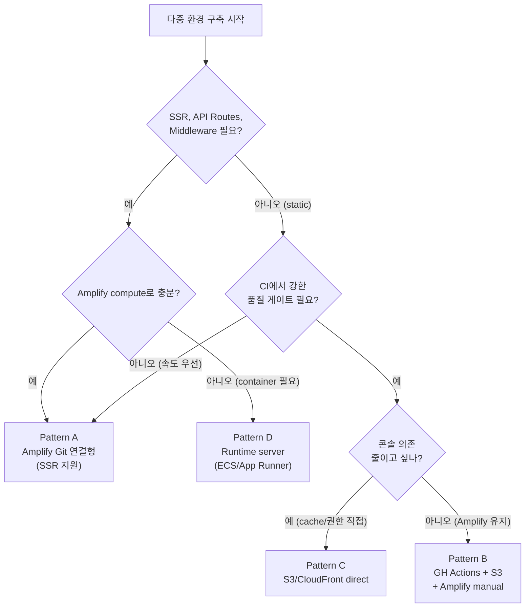

### 2.1 Pattern A: Amplify Git 연결형

Amplify Hosting이 repository branch를 직접 빌드하고 배포합니다. 초기 구축이 빠르고 branch autodetection, PR preview, custom domain, basic auth, SSR hosting을 콘솔에서 쉽게 연결할 수 있습니다.

| 적합한 경우                                          | 주의할 점                                                 |
| :--------------------------------------------------- | :-------------------------------------------------------- |
| 빠르게 PR별 preview URL이 필요함                     | build gate가 Amplify buildspec에 묶이기 쉬움              |
| Next.js SSR/SSG를 Amplify Hosting compute로 운영함   | SSR Compute role 권한을 branch별로 제한해야 함            |
| GitFlow 또는 release branch를 그대로 URL로 보고 싶음 | app당 branch quota와 orphan branch를 관리해야 함          |
| AWS 콘솔 중심 운영을 받아들일 수 있음                | 배포 승인, provenance, custom smoke는 별도 CI와 연결 필요 |

권장 설정:

- branch autodetection pattern은 `feature/*`, `dev/*`, `release/*`처럼 제한합니다.
- public repository에서 IAM service role이 필요한 preview는 보수적으로 다룹니다.
- PR preview에는 basic auth 또는 branch-level access control을 둡니다.
- branch 삭제 시 Amplify branch와 subdomain이 함께 삭제되는지 주기적으로 확인합니다.

### 2.2 Pattern B: GitHub Actions build + S3 artifact + Amplify start-deployment

GitHub Actions에서 빌드와 검증을 완료한 뒤, 산출물을 S3에 올리고 Amplify manual deployment를 시작합니다. "CI가 검증한 artifact"를 그대로 배포할 수 있어 품질 게이트와 증적을 강하게 유지할 수 있습니다.

| 적합한 경우                                                 | 주의할 점                                                 |
| :---------------------------------------------------------- | :-------------------------------------------------------- |
| GitHub Actions에서 테스트, 보안, provenance를 통제하고 싶음 | Amplify manual deploy는 SSR 앱에 맞지 않습니다.           |
| build once, deploy many가 중요함                            | 환경별 build-time env가 섞이지 않게 설계해야 합니다.      |
| artifact registry와 rollback artifact를 남기고 싶음         | zip 또는 bucket prefix 구조를 표준화해야 합니다.          |
| AWS 콘솔 접근 없이 배포하고 싶음                            | Amplify app id, branch name, S3 prefix 관리가 필요합니다. |

배포 흐름:

```text
next build
  -> static output or hosting bundle
  -> s3://frontend-artifacts/<service>/<sha>/
  -> aws amplify start-deployment
      --source-url-type BUCKET_PREFIX
      --source-url s3://frontend-artifacts/<service>/<sha>/
```

### 2.3 Pattern C: GitHub Actions build + S3/CloudFront direct deploy

Next.js static export, Vite, CRA, Storybook, 정적 문서처럼 HTML/CSS/JS만 있으면 S3 bucket과 CloudFront distribution으로 직접 운영할 수 있습니다. Amplify보다 더 명시적인 cache, origin, invalidation, domain 제어가 가능합니다.

| 적합한 경우                                              | 주의할 점                                                           |
| :------------------------------------------------------- | :------------------------------------------------------------------ |
| 정적 hosting만 필요함                                    | Next.js SSR, API Routes, Middleware가 필요한 경우 부적합            |
| cache-control과 CloudFront behavior를 직접 설계하고 싶음 | SPA fallback, 404, directory routing을 직접 구성해야 함             |
| preview를 S3 prefix로 많이 만들고 싶음                   | prefix cleanup과 domain routing 자동화가 필요함                     |
| 비용과 권한을 낮게 유지하고 싶음                         | production bucket public access와 OAC/OAI 정책을 정확히 설계해야 함 |

### 2.4 Pattern D: Runtime server 배포

Next.js SSR, API Routes, Middleware, ISR, image optimization, server action 같은 런타임 기능이 핵심이면 정적 hosting이 아니라 Amplify Hosting compute, container, App Runner, ECS, Lambda adapter 등 runtime server가 필요합니다.

| 질문                                                     | 선택                                                       |
| :------------------------------------------------------- | :--------------------------------------------------------- |
| `output: 'export'`로 빌드 가능한가                       | S3/CloudFront 또는 Amplify static                          |
| SSR, API Routes, Middleware가 필요한가                   | Amplify Hosting compute 또는 server runtime                |
| preview마다 backend도 분리해야 하는가                    | Amplify fullstack branch, sandbox backend, ephemeral stack |
| production과 같은 artifact를 staging에서 검증해야 하는가 | GitHub Actions artifact 중심                               |

### 2.5 AWS 공식 제약 체크리스트

| 항목                             | 확인 내용                                                                           | 설계 영향                                                                             |
| :------------------------------- | :---------------------------------------------------------------------------------- | :------------------------------------------------------------------------------------ |
| Amplify PR preview quota         | PR preview는 Amplify app의 branch quota를 사용합니다.                               | 오래된 PR close와 cleanup report가 필요합니다.                                        |
| public repository + service role | public repo에서 IAM service role이 필요한 backend/WEB_COMPUTE preview는 제한됩니다. | public repo는 static preview 또는 branch-level role 검토가 필요합니다.                |
| Amplify manual deploy            | S3/URL/zip 기반 manual deploy는 SSR 앱에 맞지 않습니다.                             | SSR은 Amplify Git 연결형 또는 runtime server로 둡니다.                                |
| manual zip size                  | zip manual deploy는 S3 copy 제약으로 큰 artifact에 한계가 있습니다.                 | 큰 앱은 `BUCKET_PREFIX` 또는 direct S3/CloudFront를 검토합니다.                       |
| `start-deployment` timing        | `create-deployment` 후 `start-deployment`까지 허용 시간이 제한됩니다.               | create/start를 한 job에서 처리하거나 source URL 직접 start를 씁니다.                  |
| Amplify env var secret           | Amplify 환경 변수는 설정값 용도이고 secret 저장소로 쓰지 않습니다.                  | secret은 Amplify Secret, SSM Parameter Store, GitHub environment secret로 분리합니다. |
| Next.js support                  | Amplify Hosting compute는 Next.js SSR 기능 중 일부 미지원 항목이 있습니다.          | streaming, Edge API Routes, On-Demand ISR 필요 여부를 사전에 확인합니다.              |
| CloudFront OAC                   | S3 REST origin 보호에는 OAC가 권장됩니다.                                           | S3 website endpoint와 OAC는 같은 방식으로 쓰지 않습니다.                              |

---

## 3. Next.js와 React 앱 배포 기준

### 3.1 Static export 기준

정적 hosting을 쓰려면 Next.js 설정에서 static export가 가능한지 먼저 확인합니다.

```ts
// next.config.ts
import type { NextConfig } from 'next'

const nextConfig: NextConfig = {
  output: 'export',
}

export default nextConfig
```

정적 export는 HTML/CSS/JS를 서빙하는 모든 hosting에 배포할 수 있지만, 서버 기능이 필요한 route는 사용할 수 없습니다. `getServerSideProps`, API Routes, Middleware, dynamic server function, 기본 image optimization, ISR 같은 기능이 필요하면 static export를 억지로 맞추지 말고 runtime hosting으로 전환합니다.

### 3.2 Amplify Next.js 기준

Amplify Hosting은 Next.js SSR 앱을 compute provider로 배포할 수 있습니다. 빌드 설정은 앱 형태에 따라 달라집니다.

```yaml
# amplify.yml, SSR/SSG 혼합 Next.js 예시
version: 1
frontend:
  phases:
    preBuild:
      commands:
        - corepack enable
        - pnpm install --frozen-lockfile
    build:
      commands:
        - pnpm run build
  artifacts:
    baseDirectory: .next
    files:
      - '**/*'
  cache:
    paths:
      - node_modules/**/*
      - .next/cache/**/*
```

정적 export output을 S3/CloudFront로 직접 배포하는 경우에는 `out` 또는 프로젝트에서 정한 output directory를 artifact root로 삼습니다.

### 3.3 환경 변수 분리

| 구분                  | 예시                                     | 원칙                                           |
| :-------------------- | :--------------------------------------- | :--------------------------------------------- |
| build-time public     | `NEXT_PUBLIC_API_BASE_URL`               | client bundle에 박히므로 secret 금지           |
| runtime server        | `API_INTERNAL_URL`, `SESSION_SECRET`     | server runtime에서만 읽음                      |
| runtime public config | `/config/env.json`, edge response header | 같은 artifact를 여러 환경에 승격할 때 사용     |
| CI deployment config  | `AWS_ROLE_ARN`, `AMPLIFY_APP_ID`         | GitHub environment variable 또는 secret로 관리 |

다중 개발 서버를 고도화하려면 "환경별로 다시 빌드"보다 "하나의 artifact + runtime public config"가 더 안전합니다. 다만 Next.js static export는 public 환경 값이 build output에 포함되기 쉬우므로, 환경별 build가 필요하다면 artifact 이름에 environment와 source revision을 포함하고 검증 증거를 분리합니다.

---

## 4. GitHub Actions 파이프라인 설계

### 4.1 이벤트와 동시성

```yaml
name: frontend-preview

on:
  pull_request:
    types: [opened, synchronize, reopened, closed]
  push:
    branches:
      - main
      - develop
      - 'feature/**'
  workflow_dispatch:
    inputs:
      target:
        type: choice
        options: [preview, staging, production]

concurrency:
  group: frontend-${{ github.ref }}-${{ github.event_name }}
  cancel-in-progress: true
```

동시성 그룹은 같은 PR 또는 같은 branch에 오래된 배포가 겹치지 않게 막습니다. production 배포는 `environment: production`을 사용해 reviewer, branch rule, secret 접근을 제한합니다.

### 4.2 OIDC 권한

```yaml
permissions:
  contents: read
  id-token: write
  deployments: write

jobs:
  deploy-preview:
    runs-on: ubuntu-latest
    environment:
      name: preview
      url: ${{ steps.deploy.outputs.url }}
    steps:
      - uses: actions/checkout@v6

      - name: Configure AWS credentials
        uses: aws-actions/configure-aws-credentials@v6
        with:
          role-to-assume: ${{ vars.AWS_PREVIEW_ROLE_ARN }}
          aws-region: ${{ vars.AWS_REGION }}
```

장기 `AWS_ACCESS_KEY_ID`와 `AWS_SECRET_ACCESS_KEY`를 repository secret에 저장하는 방식은 피합니다. AWS IAM trust policy는 repository, branch, environment claim을 조건으로 제한합니다.

### 4.3 Build와 artifact

> **일상 비유**: build-once, deploy-many는 한 번 만든 도시락(artifact)을 여러 식당(환경)에 그대로 배달하는 것과 같습니다. 식당마다 다시 요리하지 않으니 맛(런타임 동작)이 똑같이 보장됩니다.

이 그림은 한 commit이 들어왔을 때 install → checks → build → package → upload로 흐르는 단일 빌드 파이프라인을 보여줍니다.

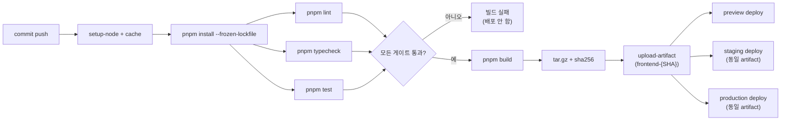

> **핵심 규칙**: ① lint/typecheck/test는 build 이전에 실패해야 한다(쓰레기 artifact 방지). ② 한 번 만든 artifact는 환경별로 재빌드하지 않는다. ③ checksum을 함께 업로드해 무결성을 보장한다.

```yaml
- uses: actions/setup-node@v6
  with:
    node-version-file: .nvmrc
    cache: pnpm

- run: corepack enable
- run: pnpm install --frozen-lockfile
- run: pnpm lint
- run: pnpm typecheck
- run: pnpm test
- run: pnpm build

- name: Package static output
  run: |
    tar -czf app.tar.gz -C out .
    shasum -a 256 app.tar.gz > app.tar.gz.sha256

- uses: actions/upload-artifact@v6
  with:
    name: frontend-${{ github.sha }}
    path: |
      app.tar.gz
      app.tar.gz.sha256
```

배포 job은 이 artifact를 다운로드해서 사용합니다. staging과 production에서 다시 빌드하지 않습니다.

### 4.4 PR preview workflow 전체 뼈대

아래 workflow는 static export 또는 Vite/SPA처럼 `out` 또는 `dist`를 S3/Amplify manual deploy로 올릴 수 있는 앱을 기준으로 합니다. SSR 앱은 이 workflow의 build/test/comment 구조만 가져가고 배포 단계는 Amplify Git branch 또는 runtime server로 바꿉니다.

```yaml
name: frontend-preview

on:
  pull_request:
    types: [opened, synchronize, reopened, closed]

permissions:
  contents: read
  id-token: write
  pull-requests: write
  deployments: write

concurrency:
  group: preview-${{ github.event.pull_request.number }}
  cancel-in-progress: true

env:
  SERVICE_NAME: web
  OUTPUT_DIR: out

jobs:
  cleanup:
    if: github.event.action == 'closed'
    runs-on: ubuntu-latest
    environment: preview
    steps:
      - uses: aws-actions/configure-aws-credentials@v6
        with:
          role-to-assume: ${{ vars.AWS_PREVIEW_ROLE_ARN }}
          aws-region: ${{ vars.AWS_REGION }}
      - name: Delete preview prefix
        run: |
          aws s3 rm "s3://${{ vars.ARTIFACT_BUCKET }}/${SERVICE_NAME}/pr-${{ github.event.pull_request.number }}/" \
            --recursive
      - name: Delete Amplify branch when used
        continue-on-error: true
        run: |
          aws amplify delete-branch \
            --app-id "${{ vars.AMPLIFY_APP_ID }}" \
            --branch-name "pr-${{ github.event.pull_request.number }}"

  deploy:
    if: github.event.action != 'closed'
    runs-on: ubuntu-latest
    environment:
      name: preview
      url: ${{ steps.deploy-url.outputs.url }}
    steps:
      - uses: actions/checkout@v6
      - uses: actions/setup-node@v6
        with:
          node-version-file: .nvmrc
          cache: pnpm
      - run: corepack enable
      - run: pnpm install --frozen-lockfile
      - run: pnpm lint
      - run: pnpm typecheck
      - run: pnpm test
      - run: pnpm build

      - name: Write deployment metadata
        run: |
          mkdir -p "${OUTPUT_DIR}"
          printf '%s\n' \
            '{' \
            '  "service": "'"${SERVICE_NAME}"'",' \
            '  "environment": "preview",' \
            '  "pullRequest": '${{ github.event.pull_request.number }}',' \
            '  "sourceRevision": "'"${GITHUB_SHA}"'"' \
            '}' > "${OUTPUT_DIR}/deployment.json"

      - uses: aws-actions/configure-aws-credentials@v6
        with:
          role-to-assume: ${{ vars.AWS_PREVIEW_ROLE_ARN }}
          aws-region: ${{ vars.AWS_REGION }}

      - name: Upload immutable assets
        run: |
          PREFIX="${SERVICE_NAME}/pr-${{ github.event.pull_request.number }}/${GITHUB_SHA}"
          aws s3 sync "${OUTPUT_DIR}" "s3://${{ vars.ARTIFACT_BUCKET }}/${PREFIX}/" \
            --delete \
            --cache-control "public,max-age=31536000,immutable" \
            --exclude "index.html" \
            --exclude "deployment.json" \
            --exclude "env.json"
          aws s3 cp "${OUTPUT_DIR}/index.html" "s3://${{ vars.ARTIFACT_BUCKET }}/${PREFIX}/index.html" \
            --cache-control "no-cache,max-age=0"
          aws s3 cp "${OUTPUT_DIR}/deployment.json" "s3://${{ vars.ARTIFACT_BUCKET }}/${PREFIX}/deployment.json" \
            --cache-control "no-cache,max-age=0"

      - name: Start Amplify manual deployment
        if: vars.AMPLIFY_APP_ID != ''
        run: |
          aws amplify start-deployment \
            --app-id "${{ vars.AMPLIFY_APP_ID }}" \
            --branch-name "pr-${{ github.event.pull_request.number }}" \
            --source-url-type BUCKET_PREFIX \
            --source-url "s3://${{ vars.ARTIFACT_BUCKET }}/${SERVICE_NAME}/pr-${{ github.event.pull_request.number }}/${GITHUB_SHA}/"

      - id: deploy-url
        run: |
          echo "url=https://pr-${{ github.event.pull_request.number }}.preview.example.com" >> "$GITHUB_OUTPUT"

      - name: Smoke test
        run: pnpm exec playwright test tests/smoke --project=chromium
        env:
          BASE_URL: ${{ steps.deploy-url.outputs.url }}

      - name: Comment preview URL
        uses: actions/github-script@v8
        with:
          script: |
            const body = [
              'Preview deployed',
              '',
              `URL: ${{ steps.deploy-url.outputs.url }}`,
              `Revision: ${process.env.GITHUB_SHA}`,
              `Expires: PR close or scheduled cleanup`,
            ].join('\n');
            await github.rest.issues.createComment({
              owner: context.repo.owner,
              repo: context.repo.repo,
              issue_number: context.issue.number,
              body,
            });
```

운영용 workflow에서는 PR comment 중복을 줄이기 위해 기존 bot comment를 찾아 update하고, `aws amplify get-job` 또는 CloudFront URL smoke 결과를 deployment status로 남깁니다.

---

## 5. Amplify + S3 artifact 배포 예시

### 5.1 S3 prefix 구조

```text
s3://frontend-artifacts/
  web/
    pr-123/
      9f1a2b3/
        index.html
        _next/
        deployment.json
    staging/
      9f1a2b3/
    production/
      9f1a2b3/
```

`deployment.json`에는 최소한 source revision, build time, package manager, artifact checksum, environment, PR number를 기록합니다.

```json
{
  "service": "web",
  "environment": "preview",
  "sourceRevision": "9f1a2b3",
  "artifactSha256": "sha256-value",
  "pullRequest": 123
}
```

### 5.2 S3 업로드와 Amplify start-deployment

```yaml
- name: Upload artifact prefix
  run: |
    aws s3 sync out "s3://${ARTIFACT_BUCKET}/web/pr-${PR_NUMBER}/${GITHUB_SHA}/" \
      --delete \
      --cache-control "public,max-age=31536000,immutable" \
      --exclude "index.html" \
      --exclude "deployment.json"
    aws s3 cp out/index.html "s3://${ARTIFACT_BUCKET}/web/pr-${PR_NUMBER}/${GITHUB_SHA}/index.html" \
      --cache-control "no-cache,max-age=0"
    aws s3 cp deployment.json "s3://${ARTIFACT_BUCKET}/web/pr-${PR_NUMBER}/${GITHUB_SHA}/deployment.json" \
      --cache-control "no-cache,max-age=0"

- name: Start Amplify deployment
  id: deploy
  run: |
    aws amplify start-deployment \
      --app-id "${AMPLIFY_APP_ID}" \
      --branch-name "pr-${PR_NUMBER}" \
      --source-url-type BUCKET_PREFIX \
      --source-url "s3://${ARTIFACT_BUCKET}/web/pr-${PR_NUMBER}/${GITHUB_SHA}/"
```

이 방식은 static site 또는 Amplify manual deployment가 지원하는 앱에 적합합니다. SSR 앱은 Amplify Git 연결형 또는 compute/runtime 배포로 처리합니다.

### 5.3 PR comment와 smoke

```yaml
- name: Smoke test preview
  run: |
    pnpm exec playwright test tests/smoke.spec.ts \
      --project=chromium \
      --grep @preview
  env:
    BASE_URL: ${{ steps.deploy.outputs.url }}
```

PR comment에는 URL만 남기지 말고 다음 정보를 같이 남깁니다.

| 항목              | 이유                          |
| :---------------- | :---------------------------- |
| preview URL       | reviewer와 QA가 바로 접근     |
| source revision   | 어떤 commit이 배포됐는지 확인 |
| smoke result      | 배포 URL 기준 검증 여부       |
| artifact checksum | rollback과 감사 추적          |
| expires at        | 정리 시점 예측                |

---

## 6. Amplify branch/PR preview 설정

### 6.1 Branch autodetection

Amplify branch autodetection은 지정한 pattern과 맞는 branch를 자동 연결할 수 있습니다.

| pattern     | 의미                          | 권장 사용                       |
| :---------- | :---------------------------- | :------------------------------ |
| `feature/*` | 기능 branch preview           | 짧은 수명 branch                |
| `dev/*`     | 개발자 또는 squad 검증 branch | 팀 내부 공유                    |
| `release/*` | release candidate branch      | QA 또는 regression              |
| `*`         | 모든 branch                   | 작은 repo에서만 제한적으로 사용 |

자동 생성 branch는 access control, environment variable, stage, PR preview 여부를 함께 설정합니다. branch가 삭제됐는데 Amplify branch와 subdomain이 남으면 cleanup workflow로 제거합니다.

### 6.2 PR preview

Amplify PR preview는 PR마다 고유 URL을 만들고, PR이 닫히면 preview URL과 임시 backend를 삭제할 수 있습니다.

운영 기준:

- PR preview는 `main` 또는 `develop` 같은 base branch별로 켭니다.
- private repository에서는 temporary backend를 만들 수 있지만, 데이터와 권한 범위를 명확히 제한합니다.
- public repository에서 service role이 필요한 SSR/compute preview는 branch-level role과 제한된 preview 정책을 사용합니다.
- app당 branch quota를 monitoring하고, 닫히지 않은 오래된 PR을 정리합니다.

### 6.3 CloudFormation 예시

```yaml
PreviewBranch:
  Type: AWS::Amplify::Branch
  Properties:
    AppId: !Ref AmplifyAppId
    BranchName: develop
    Stage: DEVELOPMENT
    EnableAutoBuild: true
    EnablePullRequestPreview: true
    EnvironmentVariables:
      - Name: NEXT_PUBLIC_STAGE
        Value: preview
```

자동 branch 생성을 IaC로 관리할 때는 `AutoBranchCreationConfig`에 pattern, stage, PR preview, environment variables를 선언합니다.

```yaml
AutoBranchCreationConfig:
  EnableAutoBranchCreation: true
  AutoBranchCreationPatterns:
    - feature/*
    - release/*
  EnableAutoBuild: true
  EnablePullRequestPreview: true
  Stage: PULL_REQUEST
```

---

## 7. S3 + CloudFront 직접 배포

> **왜 중요한가**: 정적 hosting을 S3/CloudFront로 직접 운영하면 cache, origin, invalidation, 보안 헤더를 코드로 모두 통제할 수 있습니다. 대신 SPA fallback이나 404 처리 같은 라우팅 문제를 직접 풀어야 합니다.
>
> **일상 비유**: Amplify가 "관리형 서비스 패키지 여행"이라면, S3/CloudFront 직접 운영은 "직접 차량을 빌려 다니는 자유 여행"입니다. 더 싸고 유연하지만 도로 표지(routing)와 주유(cache invalidation)를 직접 챙겨야 합니다.

### S3 + CloudFront 데이터 흐름

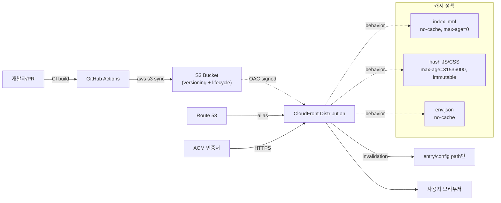

### 7.1 Bucket과 prefix 전략

| 전략                       | 설명                                           | 적합한 경우          |
| :------------------------- | :--------------------------------------------- | :------------------- |
| environment별 bucket       | `web-preview`, `web-staging`, `web-production` | 계정/권한 분리 중시  |
| environment별 prefix       | `s3://web-artifacts/preview/pr-123`            | preview 수가 많음    |
| release별 immutable prefix | `s3://web-releases/<sha>`                      | rollback과 감사 중시 |
| current pointer            | `s3://web-current/index.html`만 갱신           | 빠른 entry 전환 필요 |

production bucket은 직접 public access보다 CloudFront OAC를 기본으로 검토합니다. static website endpoint가 필요한 구조라면 공개 범위와 보안 header를 별도로 점검합니다.

### 7.2 Cache-Control 기준

```bash
aws s3 sync out s3://web-preview/pr-123/ \
  --delete \
  --cache-control "public,max-age=31536000,immutable" \
  --exclude "index.html" \
  --exclude "*.json"

aws s3 cp out/index.html s3://web-preview/pr-123/index.html \
  --cache-control "no-cache,max-age=0"
```

| 파일         | cache 기준                          | 이유                      |
| :----------- | :---------------------------------- | :------------------------ |
| `index.html` | `no-cache,max-age=0`                | release entry가 자주 바뀜 |
| hash JS/CSS  | `public,max-age=31536000,immutable` | 파일명이 바뀌면 새 asset  |
| `env.json`   | `no-cache,max-age=0`                | runtime public config     |
| image/font   | 파일명 hash가 있으면 long cache     | bandwidth 절감            |

### 7.3 Invalidation 기준

CloudFront invalidation path는 API/CLI에서 leading slash가 필요합니다. 전체 invalidation은 비용과 전파 시간을 고려해 제한하고, 일반적으로 entry와 runtime config만 invalidate합니다.

```bash
aws cloudfront create-invalidation \
  --distribution-id "$DISTRIBUTION_ID" \
  --paths "/index.html" "/env.json"
```

문제가 생겨 전체 entry와 SPA fallback을 즉시 갱신해야 할 때만 `"/*"`를 사용합니다.

### 7.4 CloudFront OAC와 SPA fallback IaC 예시

S3 origin을 CloudFront 뒤에 둘 때는 public bucket보다 Origin Access Control(OAC)을 기본 선택지로 둡니다. CloudFront OAC는 S3 REST endpoint origin과 함께 쓰며, S3 static website endpoint를 custom origin으로 쓰는 구조와는 다릅니다. SPA fallback이 필요하면 CloudFront custom error response 또는 edge function에서 `/index.html`로 보냅니다.

```yaml
PreviewBucket:
  Type: AWS::S3::Bucket
  Properties:
    BucketName: !Sub '${ServiceName}-preview-${AWS::AccountId}-${AWS::Region}'
    PublicAccessBlockConfiguration:
      BlockPublicAcls: true
      BlockPublicPolicy: true
      IgnorePublicAcls: true
      RestrictPublicBuckets: true
    VersioningConfiguration:
      Status: Enabled
    LifecycleConfiguration:
      Rules:
        - Id: DeletePreviewObjects
          Status: Enabled
          Prefix: preview/
          ExpirationInDays: 14

PreviewOAC:
  Type: AWS::CloudFront::OriginAccessControl
  Properties:
    OriginAccessControlConfig:
      Name: !Sub '${ServiceName}-preview-oac'
      OriginAccessControlOriginType: s3
      SigningBehavior: always
      SigningProtocol: sigv4

PreviewDistribution:
  Type: AWS::CloudFront::Distribution
  Properties:
    DistributionConfig:
      Enabled: true
      DefaultRootObject: index.html
      Origins:
        - Id: PreviewS3Origin
          DomainName: !GetAtt PreviewBucket.RegionalDomainName
          S3OriginConfig: {}
          OriginAccessControlId: !Ref PreviewOAC
      DefaultCacheBehavior:
        TargetOriginId: PreviewS3Origin
        ViewerProtocolPolicy: redirect-to-https
        AllowedMethods: [GET, HEAD, OPTIONS]
        CachedMethods: [GET, HEAD]
        Compress: true
        ForwardedValues:
          QueryString: false
      CustomErrorResponses:
        - ErrorCode: 403
          ResponseCode: 200
          ResponsePagePath: /index.html
        - ErrorCode: 404
          ResponseCode: 200
          ResponsePagePath: /index.html

PreviewBucketPolicy:
  Type: AWS::S3::BucketPolicy
  Properties:
    Bucket: !Ref PreviewBucket
    PolicyDocument:
      Version: '2012-10-17'
      Statement:
        - Sid: AllowCloudFrontRead
          Effect: Allow
          Principal:
            Service: cloudfront.amazonaws.com
          Action: s3:GetObject
          Resource: !Sub '${PreviewBucket.Arn}/*'
          Condition:
            StringEquals:
              AWS:SourceArn: !Sub 'arn:aws:cloudfront::${AWS::AccountId}:distribution/${PreviewDistribution}'
```

운영에서는 HTML, `env.json`, hash asset의 cache behavior를 분리하는 것이 좋습니다. CloudFront managed cache policy를 쓰거나 별도 cache policy를 만들고, entry 파일만 짧은 TTL을 적용합니다.

| behavior       | path pattern                       | cache                           |
| :------------- | :--------------------------------- | :------------------------------ |
| HTML entry     | `/`, `/index.html`, route fallback | 짧은 TTL 또는 revalidate        |
| runtime config | `/env.json`, `/deployment.json`    | 짧은 TTL                        |
| hash asset     | `/_next/static/*`, `/assets/*`     | 긴 TTL, immutable               |
| source map     | `*.map`                            | public 배포 제외 또는 접근 제어 |

---

## 8. Backend와 API 연결

### 8.1 API target 선택

| preview 유형          | API 연결                           | 기준                      |
| :-------------------- | :--------------------------------- | :------------------------ |
| UI-only PR            | MSW, fixture                       | backend 변경 없음         |
| frontend + stable API | dev API read-only                  | 데이터 변형 위험 낮음     |
| contract 변경 PR      | ephemeral API 또는 sandbox backend | schema/API 변경 검증 필요 |
| release candidate     | staging API                        | production 유사 검증      |

다중 개발 서버가 유용하려면 frontend URL만 많아서는 부족합니다. 해당 URL이 어떤 API, feature flag, analytics, auth redirect, cookie domain을 쓰는지 한눈에 보여야 합니다.

### 8.2 Runtime config endpoint

정적 배포에서 환경별 API URL이 필요하면 build-time env 대신 runtime public config를 둘 수 있습니다.

```json
{
  "stage": "preview",
  "apiBaseUrl": "https://api-preview.example.com",
  "sentryEnvironment": "preview",
  "featureFlagClientKey": "public-client-key"
}
```

이 파일은 public 정보만 포함합니다. secret, internal token, service credential은 절대 넣지 않습니다.

### 8.3 Auth redirect와 cookie

preview URL이 많아지면 auth callback URL, CORS, cookie domain 설정이 장애 지점이 됩니다.

| 항목           | 기준                                                                                  |
| :------------- | :------------------------------------------------------------------------------------ |
| OAuth callback | wildcard callback이 가능한지, 불가능하면 preview auth를 mock 또는 staging auth로 제한 |
| Cookie domain  | production cookie와 preview cookie가 섞이지 않게 분리                                 |
| CORS           | preview subdomain pattern만 허용하고 `*`와 credential 조합 금지                       |
| CSRF           | preview도 production과 같은 SameSite/Secure 정책 사용                                 |

---

## 9. 권한과 보안 설계

> **왜 중요한가**: 장기 AWS access key를 repo에 두면 단 한 번의 유출로 전체 인프라가 위험해집니다. OIDC는 키를 저장하지 않고 매 워크플로 실행 시 단기 토큰을 받는 방식이라, 유출 위험이 구조적으로 줄어듭니다.
>
> **일상 비유**: 장기 키는 "1년짜리 마스터키"이고, OIDC는 "오늘 단 한 번 출입 허용 게스트 카드"입니다. 잃어버려도 다음 날이면 무용지물입니다.

### GitHub OIDC ↔ AWS 인증 흐름

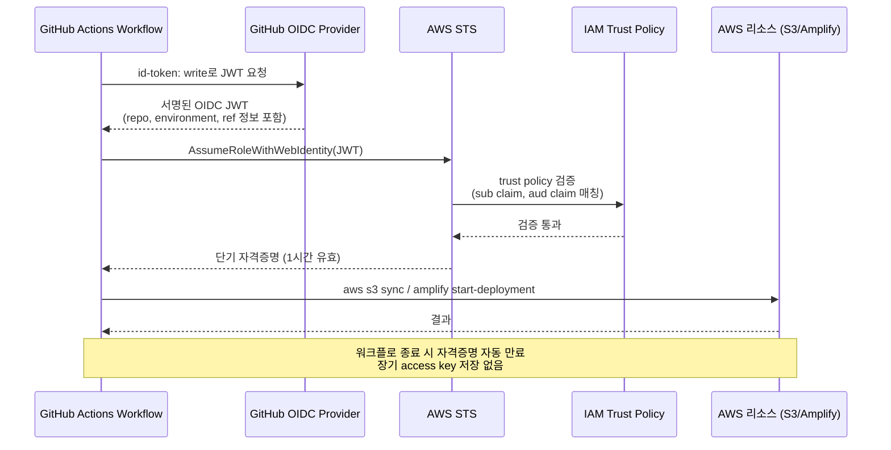

### 환경별 역할 분리

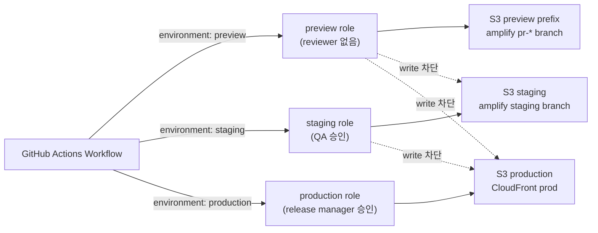

### 9.1 AWS IAM 역할 분리

| 역할                   | 허용 action                                                  | 범위                                  |
| :--------------------- | :----------------------------------------------------------- | :------------------------------------ |
| preview deploy role    | `s3:PutObject`, `s3:DeleteObject`, `amplify:StartDeployment` | preview bucket/prefix, preview branch |
| staging deploy role    | artifact read, staging deploy                                | staging app/branch                    |
| production deploy role | artifact read, production deploy, limited invalidation       | protected environment approval 후     |
| cleanup role           | preview branch delete, preview prefix delete                 | TTL 만료 resource                     |

IAM policy는 wildcard resource를 피하고 service, environment, branch naming convention으로 좁힙니다.

### 9.2 OIDC trust policy 기준

trust policy는 최소한 repository와 environment를 제한합니다.

```json
{
  "Version": "2012-10-17",
  "Statement": [
    {
      "Effect": "Allow",
      "Principal": {
        "Federated": "arn:aws:iam::123456789012:oidc-provider/token.actions.githubusercontent.com"
      },
      "Action": "sts:AssumeRoleWithWebIdentity",
      "Condition": {
        "StringEquals": {
          "token.actions.githubusercontent.com:aud": "sts.amazonaws.com"
        },
        "StringLike": {
          "token.actions.githubusercontent.com:sub": "repo:OWNER/REPO:environment:preview"
        }
      }
    }
  ]
}
```

계정 ID와 role name은 실제 문서나 PR에 그대로 노출하지 않고 예시 값으로 대체합니다.

### 9.3 Preview 접근 제어

| 환경       | 접근 정책                                            |
| :--------- | :--------------------------------------------------- |
| PR preview | basic auth, SSO, allowlist, 또는 private preview URL |
| branch dev | 팀 계정 접근                                         |
| staging    | QA/운영 승인 사용자                                  |
| production | public                                               |

preview에 실제 데이터가 노출되지 않더라도 기능 플래그, 미출시 화면, source map, debug log가 보일 수 있습니다. source map은 public artifact에 올리지 않거나 접근 제어된 오류 수집 도구에만 업로드합니다.

### 9.4 preview deploy role 최소 정책 예시

아래 정책은 static preview를 S3 prefix에 업로드하고 Amplify manual deployment를 시작하는 역할의 예시입니다. 실제 계정에서는 `Resource`를 bucket, app id, branch naming convention에 맞게 더 좁힙니다.

```json
{
  "Version": "2012-10-17",
  "Statement": [
    {
      "Sid": "WritePreviewArtifacts",
      "Effect": "Allow",
      "Action": ["s3:PutObject", "s3:DeleteObject", "s3:GetObject"],
      "Resource": "arn:aws:s3:::frontend-artifacts/web/pr-*/*"
    },
    {
      "Sid": "ListPreviewPrefixes",
      "Effect": "Allow",
      "Action": ["s3:ListBucket"],
      "Resource": "arn:aws:s3:::frontend-artifacts",
      "Condition": {
        "StringLike": {
          "s3:prefix": ["web/pr-*"]
        }
      }
    },
    {
      "Sid": "DeployPreviewBranch",
      "Effect": "Allow",
      "Action": [
        "amplify:StartDeployment",
        "amplify:GetJob",
        "amplify:CreateBranch",
        "amplify:DeleteBranch"
      ],
      "Resource": "arn:aws:amplify:ap-northeast-2:123456789012:apps/dexample/branches/pr-*"
    },
    {
      "Sid": "LimitedInvalidation",
      "Effect": "Allow",
      "Action": ["cloudfront:CreateInvalidation"],
      "Resource": "arn:aws:cloudfront::123456789012:distribution/EDFDVBD6EXAMPLE"
    }
  ]
}
```

production role은 preview role보다 좁아야 합니다. production은 write 가능한 S3 prefix를 `releases/<sha>` 또는 `current/`처럼 제한하고, GitHub `environment: production` reviewer 승인 후에만 AssumeRole 되게 합니다.

### 9.5 GitHub OIDC trust policy 설계

GitHub OIDC trust policy는 repository뿐 아니라 environment까지 제한합니다. preview, staging, production role을 분리하면 PR workflow가 production role을 얻는 사고를 줄일 수 있습니다.

```json
{
  "Version": "2012-10-17",
  "Statement": [
    {
      "Effect": "Allow",
      "Principal": {
        "Federated": "arn:aws:iam::123456789012:oidc-provider/token.actions.githubusercontent.com"
      },
      "Action": "sts:AssumeRoleWithWebIdentity",
      "Condition": {
        "StringEquals": {
          "token.actions.githubusercontent.com:aud": "sts.amazonaws.com"
        },
        "StringLike": {
          "token.actions.githubusercontent.com:sub": ["repo:OWNER/REPO:environment:preview"]
        }
      }
    }
  ]
}
```

| 역할            | `sub` 조건                               | GitHub environment          |
| :-------------- | :--------------------------------------- | :-------------------------- |
| preview role    | `repo:OWNER/REPO:environment:preview`    | reviewer 없음, 낮은 권한    |
| staging role    | `repo:OWNER/REPO:environment:staging`    | QA 또는 release owner 승인  |
| production role | `repo:OWNER/REPO:environment:production` | protected branch + reviewer |

---

## 10. Cleanup과 비용 운영

> **왜 중요한가**: 다중 환경의 가장 큰 운영 리스크는 "끝났는데 안 끝난 리소스"입니다. 닫힌 PR의 preview, 삭제된 브랜치의 Amplify branch, 오래된 S3 prefix가 누적되면 비용·보안·도메인 quota가 동시에 타격을 입습니다.
>
> **일상 비유**: 호텔 객실 청소 시스템 같습니다. 손님이 체크아웃했는데 청소가 안 들어가면 다음 손님이 못 들어오고, 그게 누적되면 전체 객실 가동률이 떨어집니다.

### Cleanup 트리거와 처리 흐름

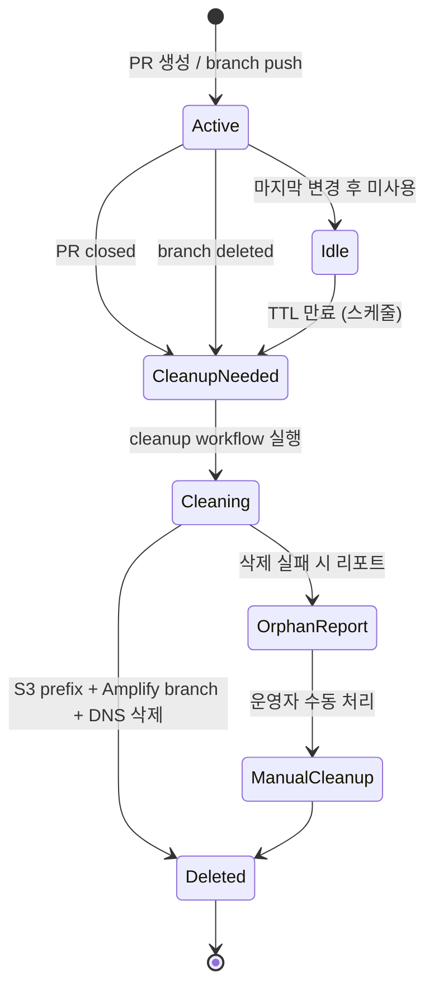

### 10.1 Cleanup trigger

| 이벤트            | 조치                                                     |
| :---------------- | :------------------------------------------------------- |
| PR closed         | preview branch, subdomain, S3 prefix 접근 차단 또는 삭제 |
| branch deleted    | Amplify branch disconnect, S3 prefix lifecycle           |
| TTL expired       | preview URL disable, artifact archive                    |
| release completed | 오래된 staging artifact 정리                             |

GitHub Actions cleanup job은 `pull_request.closed`와 schedule을 둘 다 사용합니다. webhook 누락이나 실패를 schedule job이 보완합니다.

```yaml
on:
  pull_request:
    types: [closed]
  schedule:
    - cron: '0 18 * * *'
```

### 10.2 비용 지표

| 지표                          | 경보 기준                      |
| :---------------------------- | :----------------------------- |
| active preview count          | 팀이 정한 상한 초과            |
| orphan S3 prefix              | PR/branch가 없는 prefix 발견   |
| build minutes                 | 주간 평균 대비 급증            |
| CloudFront invalidation count | 반복 전체 invalidation         |
| SSR compute usage             | preview에서 예상보다 높은 요청 |

비용을 줄이기 위해 preview를 무작정 제한하기보다, 기본 TTL, branch pattern 제한, smoke 실패 시 배포 중단, 오래된 preview 자동 정리부터 적용합니다.

### 10.3 cleanup workflow와 dry-run

cleanup은 실제 삭제 job과 dry-run report job을 분리합니다. 삭제 job은 PR close처럼 소유자가 명확한 이벤트에서 실행하고, schedule job은 먼저 orphan 후보를 보고한 뒤 제한된 범위만 삭제합니다.

```yaml
name: cleanup-preview

on:
  pull_request:
    types: [closed]
  schedule:
    - cron: '0 18 * * *'
  workflow_dispatch:
    inputs:
      dry_run:
        type: boolean
        default: true

permissions:
  contents: read
  id-token: write

jobs:
  cleanup:
    runs-on: ubuntu-latest
    environment: preview
    steps:
      - uses: actions/checkout@v6
      - uses: aws-actions/configure-aws-credentials@v6
        with:
          role-to-assume: ${{ vars.AWS_CLEANUP_ROLE_ARN }}
          aws-region: ${{ vars.AWS_REGION }}

      - name: Find closed PR preview prefixes
        run: |
          mkdir -p cleanup-report
          aws s3 ls "s3://${{ vars.ARTIFACT_BUCKET }}/web/" > cleanup-report/s3-prefixes.txt
          gh pr list --state open --json number --jq '.[].number' > cleanup-report/open-prs.txt
        env:
          GH_TOKEN: ${{ github.token }}

      - name: Delete current PR preview
        if: github.event_name == 'pull_request'
        run: |
          PR_NUMBER="${{ github.event.pull_request.number }}"
          aws s3 rm "s3://${{ vars.ARTIFACT_BUCKET }}/web/pr-${PR_NUMBER}/" --recursive
          aws amplify delete-branch \
            --app-id "${{ vars.AMPLIFY_APP_ID }}" \
            --branch-name "pr-${PR_NUMBER}" || true

      - name: Upload cleanup report
        uses: actions/upload-artifact@v6
        with:
          name: cleanup-preview-report
          path: cleanup-report
```

삭제 job에서 `aws s3 rm --recursive`를 쓸 때는 prefix가 비어 있거나 변수 치환에 실패해 상위 경로를 지우지 않도록 guard를 둡니다.

```bash
case "$PREFIX" in
  web/pr-[0-9]*/*) ;;
  *) echo "refuse to delete unsafe prefix: $PREFIX"; exit 1 ;;
esac
```

> **일상 비유**: cleanup 결정은 우체국의 분실물 처리 규정과 같습니다. 주인이 있는 짐(open PR)은 절대 건드리지 않고, 주인이 사라진 짐(closed PR, deleted branch)도 곧바로 폐기하지 않고 일정 기간(grace period)을 둔 뒤, 안전한 식별자 패턴(`pr-숫자/`)이 맞는지 한 번 더 확인한 다음에야 폐기합니다.

이 그림은 cleanup workflow가 한 prefix를 만났을 때 "지울까 둘까"를 판정하는 결정 트리입니다.

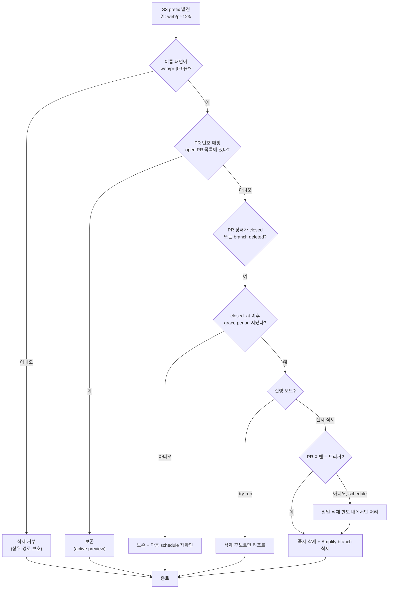

> **운영 안전망**: ① 실제 삭제는 PR close처럼 소유자가 명확한 이벤트에서 우선 처리, ② schedule job은 dry-run 리포트를 먼저 출력하고 사람이 검토, ③ 일일 삭제 한도를 두어 버그가 발생해도 폭발적 삭제가 일어나지 않게 합니다.

### 10.4 lifecycle와 quota 관리

| 대상                    | 관리 방법                                           |
| :---------------------- | :-------------------------------------------------- |
| Amplify PR preview      | PR close 자동 삭제, 50 branch quota 모니터링        |
| S3 preview artifact     | lifecycle rule로 `preview/` prefix 만료             |
| CloudFront invalidation | entry/config path만 사용, `"/*"` 사용 사유 기록     |
| ECR image               | preview tag 만료 rule                               |
| Route 53 record         | branch delete/PR close cleanup에서 삭제             |
| CloudWatch log group    | retention days를 preview와 production에 다르게 설정 |

---

## 11. 운영 Runbook

> **왜 중요한가**: 사고 상황에서 모든 사람이 같은 절차를 알고 있어야 빠르고 안전하게 복구됩니다. Runbook은 "장애 시 어떻게 행동할지"를 미리 합의해 둔 문서입니다.

### 롤백 결정 흐름

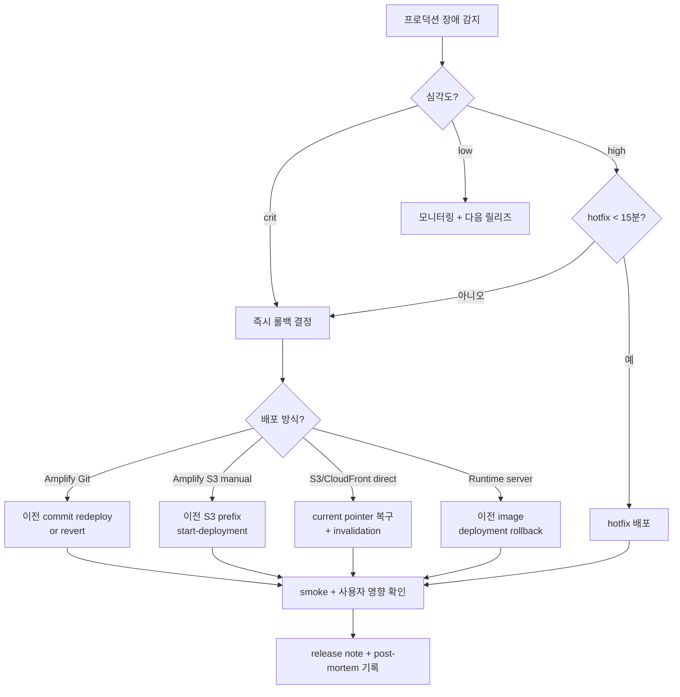

### 11.1 새 서비스에 다중 개발 서버 붙이기

1. 서비스 이름, owner, repository, main branch를 정합니다.
2. 환경 매트릭스에 local, preview, staging, production의 API, auth, data, domain을 적습니다.
3. Next.js static export 가능 여부를 확인합니다.
4. static이면 S3/CloudFront 또는 Amplify static, SSR이면 Amplify compute 또는 runtime server를 선택합니다.
5. GitHub environment를 `preview`, `staging`, `production`으로 나누고 OIDC role을 연결합니다.
6. PR preview workflow를 만들고 smoke test를 배포 URL 기준으로 실행합니다.
7. PR comment 또는 deployment UI에 URL, revision, smoke result, expiry를 남깁니다.
8. cleanup workflow와 orphan report를 켭니다.

### 11.2 Preview 장애 대응

| 증상             | 확인 순서                                                        |
| :--------------- | :--------------------------------------------------------------- |
| URL 404          | branch/prefix 존재, CloudFront behavior, Amplify job status      |
| 오래된 화면      | `index.html` cache-control, invalidation, service worker         |
| asset 403        | S3 prefix 권한, CloudFront OAC, upload root                      |
| API CORS 실패    | runtime config, allowed origin, cookie credential                |
| SSR preview 실패 | branch-level compute role, environment variable, CloudWatch logs |

### 11.3 Rollback

| 배포 방식            | rollback 방법                                                |
| :------------------- | :----------------------------------------------------------- |
| Amplify Git 연결     | 이전 commit redeploy 또는 revert commit                      |
| Amplify S3 manual    | 이전 S3 prefix로 `start-deployment` 재실행                   |
| S3/CloudFront direct | current prefix를 이전 artifact로 되돌리고 entry invalidation |
| runtime server       | 이전 image/artifact로 deployment rollback                    |

rollback 시 source revision, artifact checksum, rollback owner, cache purge 결과를 release note에 남깁니다.

---

## 12. 고도화 단계

| 단계 | 목표                        | 완료 기준                                        |
| :--- | :-------------------------- | :----------------------------------------------- |
| 1    | PR마다 URL 자동 생성        | PR comment에 preview URL과 smoke 결과 표시       |
| 2    | branch pattern과 cleanup    | branch delete/PR close 시 자동 정리              |
| 3    | OIDC와 environment approval | 장기 AWS key 제거, production reviewer 적용      |
| 4    | artifact registry           | checksum, provenance, rollback artifact 보관     |
| 5    | backend sandbox             | API/schema 변경 PR에 ephemeral backend 연결      |
| 6    | observability 분리          | preview/staging/production별 error/RUM dashboard |
| 7    | 비용 자동화                 | orphan report, TTL, budget alert                 |

---

## 13. 다른 구현 방식 비교

| 방식                      | 장점                             | 한계                             | 선택 기준                       |
| :------------------------ | :------------------------------- | :------------------------------- | :------------------------------ |
| Amplify Git branch        | 빠른 구축, PR preview, SSR 지원  | 세밀한 CI 증적은 별도 보강       | 속도와 관리형 hosting 우선      |
| Amplify S3 manual         | CI artifact 중심, 콘솔 의존 감소 | SSR manual deploy 부적합         | static output과 build once 중시 |
| S3/CloudFront direct      | 비용/캐시/권한 명시적 제어       | routing, auth, cleanup 직접 구현 | 정적 앱, 많은 preview           |
| Vercel/Netlify preview    | preview UX가 강함                | AWS 내부망/권한과 분리될 수 있음 | SaaS preview가 조직 정책에 맞음 |
| Kubernetes namespace      | backend까지 완전 분리            | 운영 복잡도와 비용 증가          | fullstack ephemeral 환경 필요   |
| Docker Compose remote dev | 통합 테스트 편함                 | public URL/리뷰 UX 약함          | 내부 QA와 API contract 검증     |

팀이 이미 AWS와 GitHub Actions를 쓰고 있다면 Amplify Git branch로 시작하고, 품질 게이트와 artifact 증적이 중요해지는 시점에 GitHub Actions orchestrated deploy로 확장하는 경로가 현실적입니다.

---

## 14. PR 완료 기준 확장

다중 개발 서버 변경 PR에는 아래 증거를 추가합니다.

| 변경            | 증거                                          |
| :-------------- | :-------------------------------------------- |
| 새 preview 환경 | URL, owner, TTL, 접근 제어                    |
| 배포 workflow   | OIDC role, environment, concurrency, rollback |
| runtime config  | public/secret 구분, bundle secret grep        |
| cache 정책      | HTML/asset/env config header 확인             |
| cleanup         | PR close 또는 schedule cleanup dry-run        |
| smoke test      | deployed URL 기준 Playwright 또는 HTTP check  |

---

## 15. 제외한 항목

이 문서는 특정 조직의 내부 AWS 계정 구조, 도메인 이름, IAM role ARN, 배포 승인자 목록, 비용 수치, private repository 설정을 표준으로 포함하지 않습니다. 팀별 실제 값은 service runbook과 IaC 변수로 관리하고, 공통 가이드에는 환경 모델과 검증 계약만 남깁니다.

---

## 실무 적용 가이드

### 언제 이 문서를 펼칠까

- PR마다 QA나 기획자가 확인할 수 있는 URL이 필요할 때
- `develop`, `staging`, `production` 외에 기능별 검증 서버가 필요할 때
- AWS Amplify와 S3, GitHub Actions를 함께 쓰면서 책임 경계가 흐려질 때
- 배포한 artifact와 검증한 artifact가 다를 때
- preview가 쌓여 비용, 권한, 도메인 정리가 어려워질 때

### 적용 순서

1. 환경 매트릭스에 local, PR preview, branch dev, staging, production의 목적과 데이터를 적는다.
2. Next.js static export 가능 여부와 SSR/API route 필요 여부를 확인한다.
3. Amplify Git branch, Amplify S3 manual, S3/CloudFront direct, runtime server 중 하나를 선택한다.
4. GitHub environment와 OIDC role을 preview/staging/production으로 분리한다.
5. PR workflow에 install, lint, type, test, build, artifact upload, deploy, smoke 순서를 둔다.
6. preview URL, source revision, smoke result, expiry를 PR에 남긴다.
7. PR close, branch delete, schedule cleanup을 모두 연결한다.
8. cache-control, invalidation, rollback artifact를 배포 runbook에 기록한다.

### 함께 두는 파일

- `.github/workflows/preview.yml`, `.github/workflows/deploy.yml`, `.github/workflows/cleanup-preview.yml`
- `infra/frontend-environments.ts` 또는 환경별 IaC module
- `apps/web/amplify.yml`, `apps/web/next.config.ts`, `apps/web/env.schema.ts`
- `apps/web/public/env.preview.json`, `apps/web/public/env.staging.json` 같은 public runtime config template
- `apps/web/tests/smoke/preview.spec.ts`와 URL 기반 smoke test
- `docs/runbooks/frontend-preview.md`와 rollback 절차

### 흔한 실수

- production API와 production cookie를 preview URL에서 그대로 사용한다.
- PR preview는 만들지만 PR close cleanup을 만들지 않는다.
- `index.html`과 hash asset에 같은 cache-control을 적용한다.
- GitHub Actions에 장기 AWS access key를 저장한다.
- 환경별로 다시 빌드하면서 artifact checksum과 검증 증거를 잃는다.
- Next.js SSR 기능을 쓰면서 static export 배포로 맞추려고 한다.
- preview URL은 만들었지만 smoke test를 배포 URL 기준으로 돌리지 않는다.

### PR 완료 기준

- [ ] 환경 매트릭스와 선택한 배포 패턴이 PR에 적혀 있다.
- [ ] GitHub Actions가 OIDC role로 AWS에 접근하고 장기 키를 사용하지 않는다.
- [ ] preview URL, source revision, artifact checksum, smoke 결과가 남는다.
- [ ] HTML, asset, runtime config의 cache-control 기준이 확인됐다.
- [ ] PR close 또는 branch delete cleanup이 검증됐다.
- [ ] rollback은 이전 artifact 또는 이전 commit으로 재현 가능하다.
- [ ] secret이 client bundle, build log, source map, public runtime config에 들어가지 않는다.

## 추천 항목 실행 우선순위 매핑

- `P1(7일 내)` — preview, staging, production 환경과 cleanup 중 하나를 작은 변경 1건에 적용하고 증거(preview URL)를 남긴다.
- `P2(30일 내)` — 다중 개발 서버 기준을 팀 템플릿, 체크리스트, CI 중 한 곳에 고정한다.
- `P3(90일 내)` — orphan 환경, preview 비용, smoke failure, branch drift 추이를 보고 기준을 유지할지 조정할지 결정한다.
- `완료 기준` — 환경 오너가 증거와 철회 조건을 확인했다는 기록을 남긴다.

## 추천 항목 실행 체크리스트

- [ ] `1단계(7일)` : preview, staging, production 환경과 cleanup 적용 대상을 1개로 좁힌다.
- [ ] `2단계(30일)` : 증거(preview URL, OIDC role, deployment log, cleanup dry-run)를 PR, ADR, 회고 중 한 곳에 연결한다.
- [ ] `3단계(60일)` : orphan 환경, preview 비용, smoke failure, branch drift가 기준 안에 들어왔는지 확인한다.
- [ ] `문제 대응` : 미달성 사유와 다음 조치, 중단 여부를 같은 기록에 남긴다.

## 추천 항목 실행 운영 규칙

- `실행 게이트` : 환경별 secret, role, URL, cleanup 책임을 먼저 분리한다.
- `승인 체계` : 환경 오너가 영향 범위와 rollback 담당자를 적용 전에 확인한다.
- `재개 조건` : preview smoke와 cleanup dry-run이 통과하면 staging/production 흐름에 연결한다.
- `정지 조건` : 임시 환경 삭제 조건이나 OIDC 최소 권한이 없으면 생성을 막는다.
- `리스크 점수` : 동시 preview 수, 권한 범위, 비용 노출로 산정한다.
- `리더 승인자` : DevOps 리드가 최종 승인 책임을 맡는다.
- `승인 역할` : 다중 개발 서버 작성자, 검토자, 운영 확인자를 분리해 기록한다.
- `재평가 주기` : 주 1회 orphan 환경과 비용을 확인한다.
