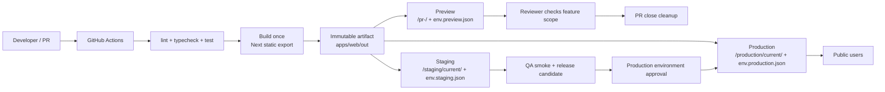
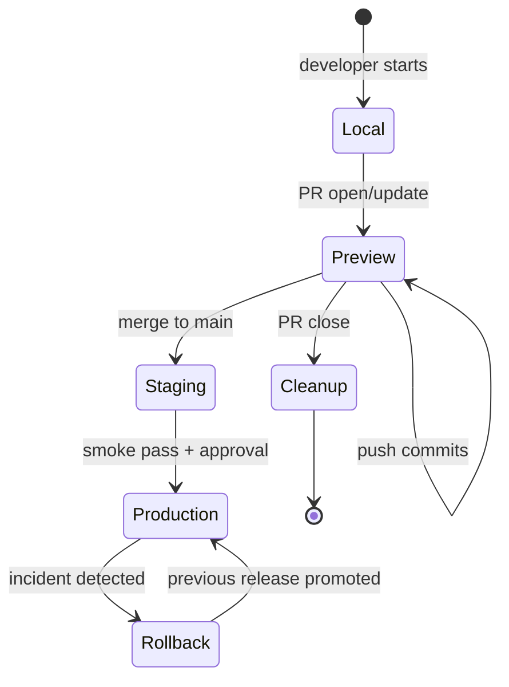
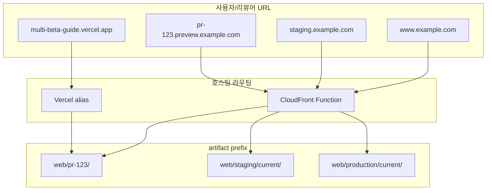
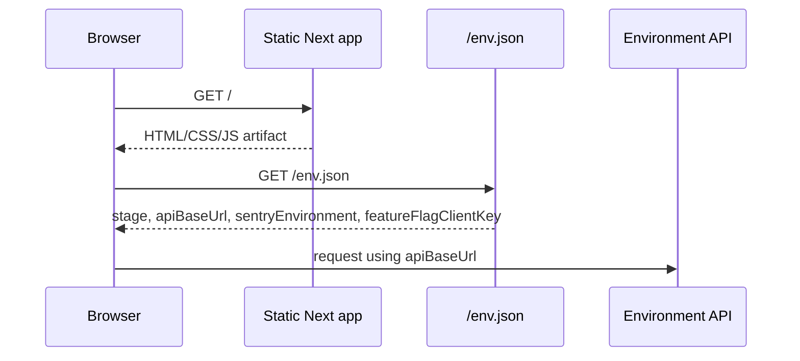
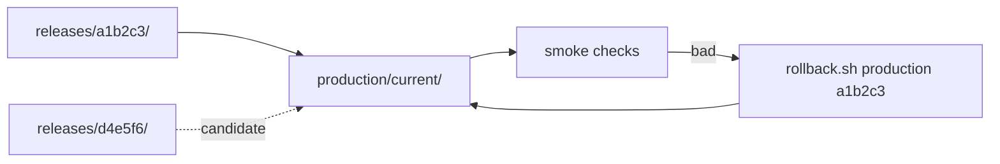

# 멀티베타환경 개발가이드

이 문서는 다중 개발 서버 구축 가이드를 이 저장소의 실제 구현과 맞춘 실행 해설서입니다.
값의 최종 기준은 여전히 [README.md](../README.md)입니다. 이 문서는 README, [ENVIRONMENTS.md](./ENVIRONMENTS.md), [runbook](./runbooks/frontend-preview.md)을 한 번에 이해할 수 있도록 아키텍처 이론, Mermaid 다이어그램, 운영 흐름을 보강합니다.

## 1. 한 문장 모델

**Next.js static export, React SPA처럼 HTML/CSS/JS 정적 리소스로 떨어지는 프론트엔드는 한 번만 빌드하고, 환경은 URL prefix, runtime `env.json`, GitHub environment 승인으로 분리합니다.**

이 모델에서 preview, staging, production은 서로 다른 앱이 아닙니다. 같은 정적 artifact를 공유하되 아래 3가지만 달라집니다.

| 분리 축         | 담당                                         | 예시                                                    |
| :-------------- | :------------------------------------------- | :------------------------------------------------------ |
| Route boundary  | Vercel alias, CloudFront Function, S3 prefix | `/pr-123/`, `/staging/current/`, `/production/current/` |
| Runtime config  | `public/env.*.json` -> 배포 시 `env.json`    | API URL, Sentry environment, public feature flag key    |
| Permission gate | GitHub OIDC role, GitHub environments        | `preview`, `staging`, `production` 역할과 승인 규칙     |

SSR, API Routes, long-running server가 필요한 앱은 이 문서의 기본 경로가 아니라 Amplify Hosting compute, ECS/App Runner, 별도 runtime server 경로로 전환해야 합니다.

## 2. 아키텍처 전체 그림

핵심은 **artifact와 environment를 분리**하는 것입니다. 코드가 환경을 직접 판단하는 순간 preview에서 본 것과 production에서 실행되는 것이 달라질 수 있습니다. 이 저장소는 `env.json`만 환경별로 바꿔 같은 앱 번들을 재사용합니다.

## 3. 멀티베타 환경이 필요한 이유

멀티베타는 “staging 하나 더 만들기”가 아니라 **검증 단위를 작게 자르는 방식**입니다.

| 문제              | 단일 staging만 있을 때                     | 멀티베타 preview가 있을 때 |
| :---------------- | :----------------------------------------- | :------------------------- |
| 여러 PR 동시 리뷰 | 변경이 섞여 원인 추적이 어려움             | PR마다 독립 URL            |
| 리뷰어 피드백     | 로컬 재현 또는 스크린샷 의존               | 실제 배포 URL에서 확인     |
| 기능 플래그       | staging 전체에 영향                        | PR 단위 public key/config  |
| cleanup           | 임시 산출물이 쌓임                         | PR close + schedule sweep  |
| production 안전성 | staging과 production 번들이 달라질 수 있음 | 같은 artifact를 승격       |

## 4. 환경 생명주기

환경별 책임은 다음처럼 구분합니다.

| 환경       | 목적             | 데이터                          | 권한                 | 종료 조건 |
| :--------- | :--------------- | :------------------------------ | :------------------- | :-------- |
| local      | 개발자 반복      | fixture/mock                    | 개인 자격증명        | 수동 종료 |
| preview    | PR 기능 검증     | mock/sandbox/read-only          | `web-gha-preview`    | PR close  |
| staging    | 릴리스 후보 검증 | 마스킹된 production 유사 데이터 | `web-gha-staging`    | 상시      |
| production | 사용자 트래픽    | production                      | `web-gha-production` | 상시      |

## 5. Route, prefix, domain 이론

도메인은 사람이 들어오는 입구이고, prefix는 저장소와 캐시의 경계입니다.

대표 Vercel URL은 개인 프로젝트 공유와 포트폴리오 공개에만 사용합니다. AWS 정식 운영 구조에서는 CloudFront + S3 prefix가 preview/staging/production의 비용, 캐시, cleanup 경계를 담당합니다. 두 경로가 같은 용어를 쓰도록 `/intro`와 이 문서를 싱크합니다.

## 6. Runtime config 경계

`env.json`에는 public 값만 둡니다. 브라우저에 내려가는 값은 secret이 될 수 없습니다. secret, DB credential, production 쓰기 토큰은 GitHub environment secret, AWS SSM Parameter Store, 서버 측 runtime에 남겨야 합니다.

## 7. 승격과 롤백 원리

staging과 production은 `releases/<sha>/`에 업로드한 불변 산출물을 `current/`로 복사해서 노출합니다. 롤백은 새 빌드를 만들지 않고 이전 release SHA를 다시 `current/`로 승격하는 작업입니다.

운영 판단 기준은 단순합니다.

| 상황                                    | 우선 행동                                                                   |
| :-------------------------------------- | :-------------------------------------------------------------------------- |
| production 장애가 크고 원인이 불명확    | 이전 release로 즉시 rollback                                                |
| 원인이 명확하고 hotfix가 15분 안에 가능 | hotfix PR -> preview -> staging -> production 승인                          |
| preview만 깨짐                          | PR artifact, prefix, env.json, CloudFront rewrite를 확인                    |
| 오래된 화면                             | `index.html`, `env.json`, `deployment.json` cache-control/invalidation 확인 |

## 8. 구현 파일 매핑

| 관심사                | 파일                                                                |
| :-------------------- | :------------------------------------------------------------------ |
| 단일 진실 공급원      | `README.md`                                                         |
| 환경 매트릭스         | `docs/ENVIRONMENTS.md`                                              |
| 이론/다이어그램 해설  | `docs/MULTI_BETA_GUIDE.md`                                          |
| 장애/rollback/cleanup | `docs/runbooks/frontend-preview.md`                                 |
| 소개 화면             | `apps/web/src/app/intro/page.tsx`                                   |
| 런타임 config 로더    | `apps/web/src/lib/runtime-config.ts`                                |
| static export 설정    | `apps/web/next.config.ts`                                           |
| preview 라우팅 함수   | `infra/terraform/functions/preview-router.js.tftpl`                 |
| 배포 스크립트         | `scripts/deploy-s3.sh`, `scripts/promote.sh`, `scripts/rollback.sh` |

## 9. 변경 시 싱크 체크리스트

아래 항목 중 하나라도 바뀌면 문서와 화면을 같이 갱신합니다.

- 환경 이름: `preview`, `staging`, `production`
- 서비스 이름: 기본 `web`, 추가 서비스는 `services = ["web", "..."]`
- S3 prefix: `<service>/pr-<n>/`, `<service>/<env>/{releases,current}`
- 공개 대표 URL: `SITE_URL`, README §운영 접속 포인트, `/intro` 대표 도메인
- runtime config schema: `apps/web/env.schema.ts`, `public/env.*.json`
- 배포/cleanup 정책: GitHub workflows, runbook, README 빠른 시작
- 보안 경계: OIDC role, GitHub environment reviewer, data masking 기준

## 10. 처음 도입하는 팀의 권장 순서

1. `README.md`의 placeholder를 본인 계정/도메인으로 채웁니다.
2. AWS 없이 `make e2e-local ENV=preview`로 앱과 `env.json` 경계를 먼저 검증합니다.
3. 대표 Vercel URL로 `/intro/`를 공유해 팀이 같은 모델을 이해하게 합니다.
4. `enable_custom_domain=false`로 CloudFront 기본 도메인 배포를 먼저 검증합니다.
5. preview PR, staging smoke, production approval을 GitHub environments로 분리합니다.
6. 도메인과 Route53이 준비되면 `*.preview`, `staging`, `www`를 추가합니다.
7. 장애가 생기기 전 `rollback.sh`와 cleanup dry-run을 한 번씩 실행해 봅니다.

## 11. 사전 생성 스크립트 사용 가이드

| 단계               | 명령                                                                                                          | 무엇을 확인하나                                                     |
| :----------------- | :------------------------------------------------------------------------------------------------------------ | :------------------------------------------------------------------ |
| 로컬 환경 미리보기 | `make app-dev ENV=preview`                                                                                    | `env.preview.json`이 `env.json`으로 주입되는지 확인                 |
| AWS 없이 E2E       | `make e2e-local ENV=staging`                                                                                  | build, static serving, smoke, Web Vitals를 로컬에서 재현            |
| 전체 검증          | `make verify`                                                                                                 | lint, format check, typecheck, unit test, build, terraform validate |
| 초기 인프라 구축   | `make bootstrap`                                                                                              | preflight, Terraform apply, GitHub variables/environments 설정      |
| S3 업로드          | `./scripts/deploy-s3.sh apps/web/out s3://<bucket>/<service>/pr-123`                                          | cache-control 분리와 runtime config 업로드                          |
| 승격               | `./scripts/promote.sh s3://<bucket>/<service>/staging/releases/<sha> s3://<bucket>/<service>/staging/current` | 같은 artifact를 current로 전환                                      |
| 롤백               | `make rollback SERVICE=web ENV=production SHA=<sha> DIST=<id>`                                                | 이전 release SHA를 current로 복구                                   |
| preview 정리       | `DRY_RUN=true ./scripts/cleanup-preview.sh sweep`                                                             | closed PR 후보와 삭제 가드 확인                                     |

스크립트 원리는 네 가지입니다.

1. `Makefile`이 긴 명령을 짧은 진입점으로 감쌉니다.
2. `env.*.json` 파일 복사로 runtime config를 주입합니다.
3. S3 업로드는 HTML/config와 hash asset을 다른 cache-control로 분리합니다.
4. cleanup/rollback은 prefix 패턴, release 존재 여부, 삭제 한도 같은 방어 조건을 먼저 확인합니다.

## 12. 운영 기준선

- preview는 빠르게 만들고 빠르게 지웁니다.
- staging은 production과 비슷해야 하지만 production secret을 가져오면 안 됩니다.
- production은 승인 없이 배포하지 않습니다.
- 같은 artifact가 승격되어야 preview/staging 검증이 의미를 가집니다.
- 비용은 prefix lifecycle, cleanup, no-server static export로 먼저 통제합니다.
