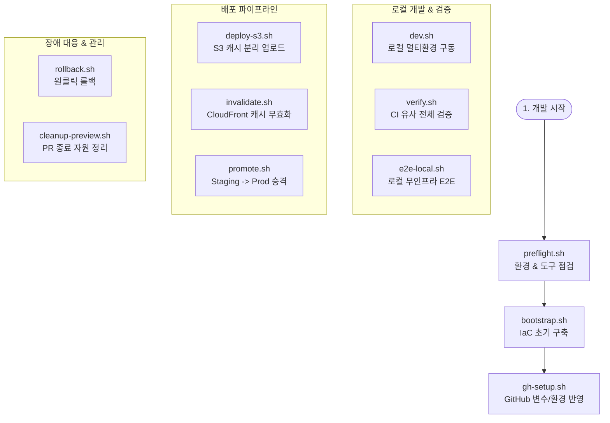

# 🛠️ scripts/ 폴더 자동화 스크립트 사용 가이드

이 문서에는 `scripts/` 폴더 내에 정의되어 있고 `Makefile` 타깃으로 매핑된 13개 셸 스크립트의 상세 설명과 사용 방법, 그리고 내부 동작 원리가 정리되어 있습니다.

---

## 🔄 전체 수명주기 스크립트 흐름



---

## 1. 사전 검증 및 인프라 구축 스크립트

### 📋 `preflight.sh` (사전 점검)
* **목적**: 개발 및 인프라 프로비저닝에 필요한 필수 로컬 CLI 도구와 AWS/GitHub 인증 상태, `terraform.tfvars` 설정 상태를 사전 점검합니다.
* **언제 실행하나**: 저장소를 처음 내려받은 후, 혹은 AWS/GitHub 로그인 토큰 정보가 갱신되었을 때 구동합니다.
* **주요 확인 항목**:
  1. `terraform`, `aws`, `gh`, `node`, `corepack/pnpm` 설치 여부
  2. AWS 자격증명 (`aws sts get-caller-identity`) 및 GitHub 인증 (`gh auth status`) 로그인 상태
  3. `infra/terraform/terraform.tfvars` 파일 구비 여부
* **사용법**:
  ```bash
  make preflight
  ```

### 🚀 `bootstrap.sh` (원커맨드 구축)
* **목적**: 사전 점검(`preflight`)을 통과한 경우, Terraform을 통한 클라우드 리소스 생성(`terraform apply`) 및 GitHub 설정(`gh-setup`)을 연달아 수행하는 부트스트랩 명령입니다.
* **언제 실행하나**: `terraform.tfvars` 파일에 변수 값들을 지정한 후, AWS 환경에 전체 다중 베타 인프라를 처음 구축할 때 사용합니다.
* **사용법**:
  ```bash
  make bootstrap
  ```

### 🔑 `gh-setup.sh` (GitHub 환경 연동)
* **목적**: `terraform apply`를 통해 동적으로 생성된 AWS 리소스의 아웃풋값(예: S3 버킷명, CF 배포 ID, OIDC ARN 등)을 읽어와 GitHub Repository Variables 및 Environments 설정을 자동 업데이트합니다.
* **언제 실행하나**: Terraform을 새로 구성했거나, AWS 리소스 값이 변동되었을 때 사용합니다.
* **사용법**:
  ```bash
  # 프로덕션 배포 시 승인이 필요한 경우 (승인자 지정)
  PROD_REVIEWER="github-username" make gh-setup
  ```

### 📦 `tf-backend.sh` (Terraform 원격 Backend 구성)
* **목적**: 팀 단위 인프라 협업을 위해 Terraform state 파일을 로컬 PC가 아닌 S3 원격 저장소에 업로드하고, 동시 편집을 막기 위한 DynamoDB Lock을 신설합니다.
* **사용법**:
  ```bash
  make tf-backend
  ```

---

## 2. 로컬 개발 및 검증 스크립트

### 💻 `dev.sh` (로컬 환경 미리보기)
* **목적**: Next.js 모노레포 환경에서 `env.preview.json`, `env.staging.json`, `env.production.json` 중 지정한 런타임 설정 파일을 로컬 개발 서버(`/public/env.json`)에 이식하여 서버를 실행합니다.
* **언제 실행하나**: 클라우드에 실제 배포하기 전, 각 환경 간 데이터베이스 엔드포인트나 백엔드 API 주소 차이에 따른 런타임 분리가 잘 작동하는지 확인하고 싶을 때 돌립니다.
* **사용법**:
  ```bash
  make app-dev SERVICE=web ENV=preview   # preview API 기반 로컬 실행
  make app-dev SERVICE=web ENV=staging   # staging API 기반 로컬 실행
  ```

### 🔍 `verify.sh` (로컬 통합 검증 게이트)
* **목적**: CI 파이프라인에서 실행되는 검사 게이트와 100% 동일하게 모든 패키지의 Lint 검사, TypeScript Typecheck, Vitest 유닛 테스트 및 정적 빌드를 수행합니다.
* **언제 실행하나**: 브랜치에 코드를 푸시하거나 풀 리퀘스트(PR)를 올리기 전 검증 용도로 활용합니다.
* **사용법**:
  ```bash
  make verify
  ```

### 🧪 `e2e-local.sh` (로컬 E2E 테스트)
* **목적**: 클라우드 AWS 인프라 환경 없이도 static export 결과물을 로컬 가상 Python 서버로 서빙하고 Playwright Smoke E2E 테스트를 즉시 검증합니다.
* **사용법**:
  ```bash
  make e2e-local SERVICE=web ENV=preview
  ```

---

## 3. 배포 및 릴리스 파이프라인 스크립트

### 📤 `deploy-s3.sh` (S3 캐시 최적화 업로드)
* **목적**: Next.js 빌드 산출물(`out/`)을 S3에 동기화할 때, 자산 파일 종류별로 최적의 브라우저 캐시 정책(`Cache-Control`)을 구분하여 업로드합니다.
* **동작 원칙**:
  * 해시 자산(JS/CSS/이미지 등): `public,max-age=31536000,immutable` 헤더를 입혀 업로드합니다.
  * 엔트리 및 설정 파일(`index.html`, `env.json` 등): 항상 새로운 요청이 이루어지도록 `no-cache,max-age=0`을 입혀 덮어씁니다.
  * 소스맵(`.map`)과 설정 템플릿(`env.*.json`)은 업로드 대상에서 필터링 제거합니다.
* **사용법**:
  ```bash
  ./scripts/deploy-s3.sh <빌드산출물경로> s3://<대상버킷명>/<Prefix>
  # 예: ./scripts/deploy-s3.sh apps/web/out s3://my-bucket/web/pr-123
  ```

### 🧹 `invalidate.sh` (CloudFront 캐시 무효화)
* **목적**: 신규 배포가 적용된 후, CloudFront 엣지 서버에 남아있는 기존 html 캐시 등을 파괴(Invalidate)하여 배포본이 고객 브라우저에 바로 노출되도록 강제합니다.
* **사용법**:
  ```bash
  ./scripts/invalidate.sh <DISTRIBUTION_ID> "<무효화할_경로>"
  ```

### 👑 `promote.sh` (스테이징 -> 프로덕션 승격)
* **목적**: Staging 환경에 정착하여 검증이 끝난 `/staging/releases/<revision>` 내 정적 파일을 그대로 Production 환경의 `/production/current` 및 `/production/releases/<revision>` 경로에 AWS S3 내부 통신(S3 Copy)으로 고속 복제합니다.
* **동작 원칙**: **Build-once, Deploy-many** 사상을 완전히 충족합니다. 릴리스를 위한 재빌드를 수행하지 않고 이미 완벽히 검증된 파일의 무결성을 그대로 이관하므로 릴리스 시점에 빌드 에러나 환경 정보 혼입 현상이 원천 배제됩니다.
* **사용법**:
  ```bash
  ./scripts/promote.sh <S3_버킷명> <서비스명>
  ```

---

## 4. 운영 대응 및 리소스 클린업 스크립트

### ⏪ `rollback.sh` (원클릭 롤백)
* **목적**: 상용 production 환경에 장애가 발생하였을 때, 과거에 정상 배포되었던 Git SHA 아티팩트를 찾아 복구본으로 덮어쓰고 캐시를 초기화해 순식간에 복원을 달성합니다.
* **사용법**:
  ```bash
  make rollback SERVICE=web ENV=production SHA=<복원시킬_SHA> DIST=<CF_배포_ID>
  ```

### 🗑️ `cleanup-preview.sh` (임시 자원 정리)
* **목적**: pull request가 merge되거나 close된 후, 혹은 브랜치가 삭제되었을 때 생성되어 남아있던 프리뷰 정적 소스(S3 Object)를 삭제하고 CLI 리소스 등록을 청소합니다.
* **사용법**:
  ```bash
  PR_NUMBER=123 ./scripts/cleanup-preview.sh
  ```

### 🌿 `new-service.sh` (새로운 서비스 스캐폴딩)
* **목적**: 모노레포 환경에 기존 서비스(web 등)와 동일한 빌드, 린트, 테스트 규칙 및 런타임 설정 규격을 따르는 새 정적 웹서비스 폴더를 구축합니다.
* **사용법**:
  ```bash
  make new-service NAME=my-new-app
  ```
