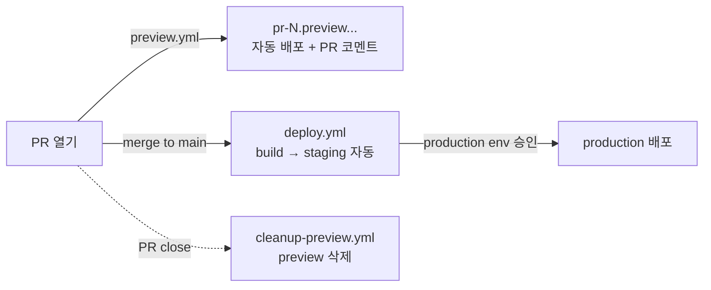

# SETUP — AWS에 0부터 구축하기 (어디를 수정해야 하나)

이 문서는 **"어떤 파일의 어느 부분을 바꿔야 실제로 동작하는가"**를 단계별로 설명합니다.
개념은 [원본 가이드](https://github.com/blue45f/heejun/blob/main/public/%EA%B0%9C%EB%B0%9C%EA%B0%80%EC%9D%B4%EB%93%9C/27_%EB%8B%A4%EC%A4%91_%EA%B0%9C%EB%B0%9C_%EC%84%9C%EB%B2%84_%EA%B5%AC%EC%B6%95_%EA%B0%80%EC%9D%B4%EB%93%9C.md)와 [README](../README.md)를 참고하세요.

> **핵심 원칙 (최소 수정으로 구축)**: 코드/워크플로/IaC의 **이름 규칙은 건드리지 않습니다.** 바꾸는 것은 거의 전부 `infra/terraform/terraform.tfvars` **한 파일**과, 거기서 나온 출력값을 **GitHub repo 변수**에 붙이는 것뿐입니다. 이름 규칙(`web`, `pr-<n>`, `web/<env>/current` 등)을 바꾸면 여러 파일을 동시에 고쳐야 하므로 기본값 유지를 권장합니다(§8).

---

## 0. 사전 준비물

| 도구 | 용도 | 설치 확인 |
| :--- | :--- | :--- |
| AWS 계정 + CLI 권한 | 인프라 생성 | `aws sts get-caller-identity` |
| [Terraform](https://developer.hashicorp.com/terraform/install) >= 1.6 | 인프라 프로비저닝 | `terraform version` |
| [AWS CLI v2](https://docs.aws.amazon.com/cli/latest/userguide/getting-started-install.html) | 배포 스크립트 | `aws --version` |
| [GitHub CLI](https://cli.github.com/) (`gh`) | repo 변수 설정/cleanup | `gh auth status` |
| Node 22 + pnpm(corepack) | 앱 빌드 | `node -v` (이 repo는 `.nvmrc`로 22 고정) |
| (선택) 도메인 + Route53 hosted zone | custom 도메인 | — |

> AWS/GitHub 로그인이 필요하면 이 세션 프롬프트에 `! aws configure` 또는 `! gh auth login`처럼 `!` 접두사로 직접 실행할 수 있습니다.

---

## 1. 무엇을, 어디서 바꾸나 (마스터 표)

아래 값만 본인 환경으로 바꾸면 됩니다.

| # | 바꿀 값 | 파일 | 위치(항목) | 예시 → 바꿀 값 |
| :-- | :--- | :--- | :--- | :--- |
| 1 | GitHub owner | `infra/terraform/terraform.tfvars` | `github_owner` | `blue45f` → 본인 |
| 2 | GitHub repo | `infra/terraform/terraform.tfvars` | `github_repo` | `heejun` → 본인 |
| 3 | 리전 | `infra/terraform/terraform.tfvars` | `aws_region` | `ap-northeast-2` (서울) |
| 4 | 서비스명 | `infra/terraform/terraform.tfvars` | `service_name` | `web` (그대로 권장) |
| 5 | OIDC provider 신규 생성 여부 | `infra/terraform/terraform.tfvars` | `create_oidc_provider` | 계정에 이미 있으면 `false` + import |
| 6 | custom 도메인 사용 | `infra/terraform/terraform.tfvars` | `enable_custom_domain` | 도메인 있으면 `true` |
| 7 | 도메인 값들 | `infra/terraform/terraform.tfvars` | `apex_domain`/`staging_host`/`production_host`/`hosted_zone_id` | `example.com` → 본인 도메인 |
| 8 | GitHub repo variables | GitHub UI 또는 `gh` | Settings → Variables | `terraform output`이 알려줌 (§3) |
| 9 | GitHub environments | GitHub UI | Settings → Environments | `preview`/`staging`/`production` (§3) |
| 10 | 런타임 API 주소 등 | `apps/web/public/env.*.json` | `apiBaseUrl` 등 | `https://api-*.example.com` → 본인 API |
| 11 | (SSR 필요 시) export 해제 | `apps/web/next.config.ts` | `output: 'export'` 줄 | 제거 + 배포 방식 변경 (§7) |
| 12 | (선택) Amplify 사용 | GitHub variable `AMPLIFY_APP_ID` | — | 비우면 Amplify 단계 자동 skip |

> 코드(`infra/terraform/*.tf`, `.github/workflows/*`, `scripts/*`)는 이 값들을 **변수로 참조**하므로 직접 수정할 필요가 없습니다.

---

## 1.5 빠른 경로 (원커맨드)

위 표 #1~#2(`github_owner`/`github_repo`)만 `terraform.tfvars`에 채우면, 나머지(terraform apply → GitHub 변수 → environments)는 한 번에 끝납니다.

```bash
cp infra/terraform/terraform.tfvars.example infra/terraform/terraform.tfvars   # 값 입력
make bootstrap                          # preflight → terraform apply → gh-setup
PROD_REVIEWER=<github-login> make gh-setup   # (선택) production 필수 리뷰어까지
```

내부적으로 `scripts/preflight.sh`(사전 점검) → `terraform apply` → `scripts/gh-setup.sh`(터미널에서 `terraform output`을 읽어 `gh variable set` + environments 생성)를 수행합니다. 아래 §2~§3은 이 과정을 수동으로 풀어 쓴 것이며, 무엇이 일어나는지 이해하거나 단계별로 진행할 때 참고합니다.

---

## 2. 인프라 프로비저닝 (Terraform)

### 2.1 tfvars 작성 — `infra/terraform/terraform.tfvars`

```bash
cd infra/terraform
cp terraform.tfvars.example terraform.tfvars
```

`terraform.tfvars`를 열어 **표 #1~#7**을 채웁니다. 처음에는 도메인 없이 시작하길 권장합니다:

```hcl
github_owner         = "blue45f"   # ← 본인
github_repo          = "heejun"    # ← 본인
aws_region           = "ap-northeast-2"
create_oidc_provider = true        # 계정에 GitHub OIDC가 이미 있으면 false (아래 import)
enable_custom_domain = false       # 1차: 도메인 없이 CloudFront 기본 도메인으로 테스트
```

> **이미 GitHub OIDC provider가 있는 계정**이면 `create_oidc_provider = false`로 두고 한 번만 import 합니다(계정당 1개만 존재 가능):
> ```bash
> terraform import 'aws_iam_openid_connect_provider.github[0]' \
>   arn:aws:iam::<ACCOUNT_ID>:oidc-provider/token.actions.githubusercontent.com
> ```

### 2.2 apply

```bash
terraform init
terraform plan      # 생성될 리소스 검토
terraform apply
```

생성물: artifact용 S3 버킷, CloudFront 배포 3개(preview/staging/production), CloudFront Function(preview 라우팅), OIDC 역할 4개, (도메인 켜면) ACM 인증서 + Route53 레코드.

### 2.3 출력값 확인

```bash
terraform output
terraform output -raw gh_variable_commands   # GitHub 변수 설정 명령 모음
```

### 2.4 (나중에) custom 도메인 켜기

도메인이 준비되면 `terraform.tfvars`에서 표 #6~#7을 채우고 다시 `apply` 합니다:

```hcl
enable_custom_domain = true
apex_domain          = "example.com"
preview_subdomain    = "preview"             # → *.preview.example.com
staging_host         = "staging.example.com"
production_host      = "www.example.com"
hosted_zone_id       = "Z0123456789ABCDEFGHIJ"   # apex_domain의 Route53 zone ID
```

> CloudFront용 ACM 인증서는 요구사항에 따라 자동으로 **us-east-1**에 생성됩니다(코드가 provider alias로 처리). hosted zone은 미리 존재해야 합니다.

### 2.5 (팀/운영, 선택) 원격 state

기본은 로컬 state라 혼자 쓰기엔 충분하지만, **여러 명이 같은 환경을 공유·반복 구축**하려면 원격 state(S3 + DynamoDB lock)를 권장합니다.

```bash
make tf-backend     # state 버킷 + 락 테이블 생성 + infra/terraform/backend.hcl 작성 (멱등)
# versions.tf 의 'backend "s3" {}' 주석 해제 후:
terraform -chdir=infra/terraform init -backend-config=backend.hcl -migrate-state
```

`backend.hcl`은 환경별 값이라 gitignore되며, 형식은 `backend.hcl.example`을 참고하세요. 이미 `terraform apply`로 만든 로컬 state가 있으면 `-migrate-state`가 원격으로 옮겨줍니다.

---

## 3. GitHub 설정

### 3.1 Repository variables

`terraform output -raw gh_variable_commands` 결과를 그대로 실행하거나 수동 설정합니다.

```bash
# 예시 — 실제 값은 terraform output에서 가져옵니다
gh variable set AWS_REGION --body "ap-northeast-2"
gh variable set ARTIFACT_BUCKET --body "web-frontend-artifacts-123456789012-ap-northeast-2"
gh variable set AWS_PREVIEW_ROLE_ARN --body "arn:aws:iam::123456789012:role/web-gha-preview"
gh variable set AWS_STAGING_ROLE_ARN --body "arn:aws:iam::123456789012:role/web-gha-staging"
gh variable set AWS_PRODUCTION_ROLE_ARN --body "arn:aws:iam::123456789012:role/web-gha-production"
gh variable set AWS_CLEANUP_ROLE_ARN --body "arn:aws:iam::123456789012:role/web-gha-cleanup"
gh variable set PREVIEW_DISTRIBUTION_ID --body "E1AAAAAAAAAAAA"
gh variable set STAGING_DISTRIBUTION_ID --body "E2BBBBBBBBBBBB"
gh variable set PRODUCTION_DISTRIBUTION_ID --body "E3CCCCCCCCCCCC"
```

**도메인을 쓰는지에 따라 URL 변수를 설정합니다:**

```bash
# (A) custom 도메인 사용 시
gh variable set PREVIEW_BASE_DOMAIN --body "preview.example.com"
gh variable set STAGING_DOMAIN --body "staging.example.com"
gh variable set PRODUCTION_DOMAIN --body "www.example.com"

# (B) 도메인 없이 CloudFront 기본 도메인으로 테스트 시 (preview는 path 기반 접근)
gh variable set PREVIEW_CLOUDFRONT_DOMAIN \
  --body "$(terraform -chdir=infra/terraform output -raw preview_cloudfront_domain)"
# STAGING_DOMAIN / PRODUCTION_DOMAIN 은 비워두면 smoke 단계가 자동 skip 됩니다.
```

> 변수가 비어 있으면 워크플로의 smoke/URL 단계가 자동으로 건너뛰도록 작성돼 있어, 도메인 없이도 배포 자체는 동작합니다.

### 3.2 Environments

`Settings → Environments`에서 3개를 만듭니다. 이름이 OIDC trust 조건(`repo:OWNER/REPO:environment:<env>`)과 **정확히** 일치해야 합니다.

| environment | 보호 규칙 | 이유 |
| :--- | :--- | :--- |
| `preview` | 없음 | PR마다 빠르게 배포 |
| `staging` | (선택) QA reviewer | release candidate |
| `production` | **Required reviewers 지정 + Deployment branches: `main`만** | 승인 게이트. `deploy.yml`의 production job이 여기서 멈춰 승인을 기다립니다. |

> `production`에 reviewer를 걸지 않으면 승인 없이 바로 배포됩니다. 반드시 설정하세요.

---

## 4. 앱 설정

### 4.1 런타임 config (표 #10) — `apps/web/public/env.*.json`

값을 본인 API로 바꿉니다. 키 구조는 `apps/web/env.schema.ts`(zod)가 강제합니다.

```jsonc
// apps/web/public/env.production.json
{
  "stage": "production",
  "apiBaseUrl": "https://api.example.com",     // ← 본인 production API
  "sentryEnvironment": "production",
  "featureFlagClientKey": "public-prod-key"     // ← public 키만! secret 금지
}
```

> ⚠️ 이 파일은 브라우저에 그대로 노출됩니다. **secret/내부 토큰 금지.** 키를 추가/변경하려면 `apps/web/env.schema.ts`부터 고치세요. 배포 워크플로가 `public/env.<stage>.json`을 `out/env.json`으로 복사해 서빙합니다.

### 4.2 로컬 확인

```bash
cd apps/web
corepack enable
pnpm install                # 락파일 커밋되어 있음
cp public/env.preview.json public/env.json   # 로컬에서 런타임 config 확인용
pnpm dev                    # http://localhost:3000
pnpm build                  # out/ 생성 확인 (static export)
```

---

## 5. 배포 흐름 (실제 사용)



1. **PR 열기** → `preview.yml`이 lint/typecheck/test/build 후 S3에 올리고 PR에 preview URL을 코멘트합니다.
2. **main에 merge** → `deploy.yml`이 한 번 빌드한 artifact를 staging에 배포하고, 이어서 production job이 **승인 대기**합니다.
3. **production environment에서 승인** → 동일 artifact가 production에 배포됩니다.
4. **PR close** → `cleanup-preview.yml`이 그 PR의 S3 prefix(와 Amplify branch)를 삭제합니다.

수동 배포: `Actions → deploy → Run workflow`에서 target(staging/production)을 골라 실행할 수 있습니다.

---

## 6. 동작 확인 체크리스트

- [ ] `terraform apply` 성공, `terraform output`에 distribution ID 3개가 보인다.
- [ ] GitHub repo variables가 설정됐다(도메인 안 쓰면 `*_DOMAIN`은 생략 가능).
- [ ] `production` environment에 required reviewer가 걸려 있다.
- [ ] 테스트 PR을 열면 Actions의 `preview`가 통과하고 PR에 URL 코멘트가 달린다.
- [ ] preview URL(또는 `https://<preview_cloudfront_domain>/pr-<n>/`)이 200으로 열린다.
- [ ] main merge 시 staging 배포 후 production이 "Waiting"으로 승인 대기한다.
- [ ] PR을 닫으면 `cleanup-preview`가 S3 prefix를 지운다.
- [ ] `Actions → cleanup-preview → Run workflow`(dry_run=true)로 orphan 후보 리포트가 나온다.

---

## 7. SSR이 필요하면 (Pattern 전환, 표 #11)

이 저장소 기본은 **static export(Pattern C)**입니다. `getServerSideProps`/API Routes/Middleware/ISR/이미지 최적화가 필요하면:

1. `apps/web/next.config.ts`에서 `output: 'export'`(및 `images.unoptimized`, `trailingSlash`)를 제거합니다.
2. 배포 대상을 정적 S3가 아니라 런타임으로 바꿉니다:
   - **Amplify Hosting compute**: 저장소를 Amplify에 Git 연결(Pattern A). `apps/web/amplify.yml`의 `baseDirectory`를 `out`에서 `.next`로 바꿉니다.
   - **컨테이너/런타임(ECS·App Runner·Lambda adapter)**: 별도 인프라가 필요합니다(가이드 §1.4.3, §2.4). 이 저장소의 OIDC·환경 분리·cleanup 원칙은 재사용하고 배포 단계만 교체합니다.

---

## 8. 이름 규칙 자체를 바꾸려면 (고급)

규칙을 바꾸면 아래가 **함께** 바뀌어야 합니다(그래서 기본값 유지 권장).

| 바꾸는 것 | 같이 고쳐야 하는 곳 |
| :--- | :--- |
| `service_name`(`web`) | tfvars(대부분 자동 전파), 워크플로 `env.SERVICE_NAME` 3개 |
| preview prefix(`pr-`) | `infra/terraform/functions/preview-router.js`(라우팅·검증), `scripts/cleanup-preview.sh`(가드 패턴), `github-oidc.tf`(role resource ARN), 워크플로 preview job |
| `current`/`releases` 구조 | `scripts/promote.sh`·`rollback.sh`, `cloudfront.tf`의 `origin_path` |
| 앱 디렉터리(`apps/web`) | 워크플로 `env.APP_DIR`/`OUTPUT_DIR`, `amplify.yml` |

---

## 9. 원본 가이드 대비 보정 사항

실제 빌드 가능하도록 원본 가이드에서 다음을 보정했습니다.

| 항목 | 원본 가이드 | 이 저장소 (보정) |
| :--- | :--- | :--- |
| GitHub Action 버전 | `upload-artifact@v6`, `github-script@v8` | 최신 기준 `upload-artifact@v7`, `download-artifact@v8`, `github-script@v9` (checkout/setup-node/configure-aws는 `@v6` 유효) |
| 멀티테넌트 preview 라우팅 | "PR마다 URL" 개념만 서술 | 단일 CloudFront + **CloudFront Function**(`preview-router.js`)으로 host/path → S3 prefix 라우팅을 실제 구현 |
| preview의 SPA fallback | CustomErrorResponse `/index.html` 예시 | preview는 테넌트 prefix를 반영해야 하므로 **Function 내부에서 fallback** 처리(CustomErrorResponse는 staging/production에만) |
| ACM 리전 | 리전 언급 없음 | CloudFront용 ACM은 반드시 **us-east-1** — Terraform이 provider alias로 처리 |
| Next RSC 캐시 | `index.html`/asset만 언급 | App Router static export의 `*.txt`(RSC 페이로드)도 **no-cache** 처리(`deploy-s3.sh`) |
| build-once 승격 | 개념 서술 | GitHub artifact를 staging→production이 **동일 바이트**로 공유, production은 environment reviewer 게이트 |

---

## 참고

- 환경별 상세: [ENVIRONMENTS.md](ENVIRONMENTS.md)
- 장애/롤백: [runbooks/frontend-preview.md](runbooks/frontend-preview.md)
- Terraform 사용법: [../infra/terraform/README.md](../infra/terraform/README.md)
- CloudFormation(대안): [../infra/cloudformation/frontend.yaml](../infra/cloudformation/frontend.yaml)
