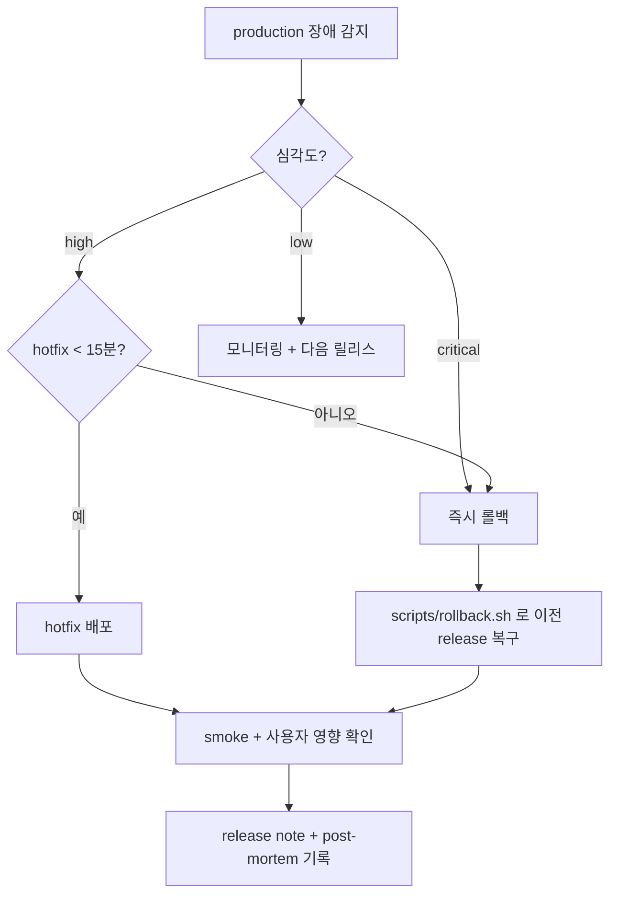

# Runbook — 프론트엔드 preview / 배포 운영

장애 대응과 롤백 절차입니다. 모든 명령은 **이 저장소의 실제 스크립트**(`scripts/*`)를 기준으로 합니다. (가이드 §11)
전체 아키텍처 이론과 Mermaid 다이어그램은 [멀티베타환경 개발가이드](../MULTI_BETA_GUIDE.md)를 참고하세요.

---

## 0. 새 서비스에 다중 개발 서버 붙이기 (요약)

1. 서비스 이름·owner·repo·main branch를 정한다. (`web` 기본)
2. 환경 매트릭스([ENVIRONMENTS.md](../ENVIRONMENTS.md))에 API/auth/data/domain을 적는다.
3. static export 가능 여부 확인(불가 시 [SETUP §7](../SETUP.md#7-ssr이-필요하면-pattern-전환-표-11)).
4. `infra/terraform` apply → OIDC role·S3·CloudFront 생성.
5. GitHub environments(`preview`/`staging`/`production`) + repo variables 설정.
6. PR을 열어 preview URL·smoke·코멘트를 확인.
7. cleanup(PR close + schedule dry-run) 동작 확인.

---

## 1. 롤백 결정 흐름



---

## 2. Preview 장애 대응

| 증상              | 확인 순서                                                                                                                                                                                                                              |
| :---------------- | :------------------------------------------------------------------------------------------------------------------------------------------------------------------------------------------------------------------------------------- |
| **URL 404**       | ① PR 워크플로가 성공했는지 ② `ARTIFACT_BUCKET`에 `web/pr-<n>/index.html`이 있는지 ③ preview distribution에 `preview-router` Function이 viewer-request로 붙어있는지 ④ `scripts/invalidate.sh <PREVIEW_DISTRIBUTION_ID> "/web/pr-<n>/*"` |
| **오래된 화면**   | ① `index.html`/`env.json`이 `no-cache`로 올라갔는지(`deploy-s3.sh`) ② `/web/pr-<n>/index.html`·`/web/pr-<n>/env.json` invalidate ③ 브라우저 service worker                                                                             |
| **asset 403**     | ① S3 prefix에 파일이 있는지 ② S3 버킷 정책이 CloudFront OAC(`AWS:SourceArn`)를 허용하는지 ③ 업로드 root 경로                                                                                                                           |
| **API CORS 실패** | ① `env.json`의 `apiBaseUrl` ② API 서버의 allowed origin에 preview 서브도메인 패턴이 있는지 ③ cookie credential 조합                                                                                                                    |

> preview 라우팅 원리: 서비스별 CloudFront Function(`preview-router.js.tftpl`, 서비스명 주입)이 `pr-<n>.preview.example.com`(또는 `<cf-domain>/pr-<n>/`)을 S3 `/<service>/pr-<n>/`로 재작성합니다. CloudFront 기본 도메인 path preview에서는 Next의 root asset(`/_next/...`) 요청이 PR prefix를 잃을 수 있으므로 같은 host의 `Referer` 첫 path segment가 `/pr-<n>/`일 때만 `pr-<n>`을 복원하고, prefix가 빠진 문서 URL은 `/pr-<n>/...`로 정규화합니다. viewer-request는 캐시 조회 **이전**에 실행되므로, invalidation 경로도 재작성된 `"/<service>/pr-<n>/*"`를 써야 합니다.

---

## 3. Rollback (staging / production)

`current` 포인터를 이전 불변 release(`releases/<sha>`)로 되돌립니다. **S3→S3 sync는 cache-control 메타데이터를 보존**하므로 캐시 정책이 유지됩니다.

```bash
# 1) 되돌릴 좋은 release(sha)를 찾는다 (<service>는 서비스명, 단일 구성이면 web)
aws s3 ls "s3://<ARTIFACT_BUCKET>/<service>/production/releases/"

# 2) 그 서비스의 production distribution id 확인 (terraform output 또는 GitHub DEPLOY_CONFIG)
terraform -chdir=infra/terraform output -json production_distribution_ids   # {"web":"E3C…", "admin":"E9…"}

# 3) 롤백 — 시그니처: rollback.sh <staging|production> <release_sha> [distribution_id]
#    멀티 서비스: ARTIFACT_BUCKET + SERVICE_NAME 을 env로 전달
ARTIFACT_BUCKET=<ARTIFACT_BUCKET> SERVICE_NAME=<service> \
  ./scripts/rollback.sh production <good-sha> <PRODUCTION_DISTRIBUTION_ID>
#   또는 한 줄로: make rollback SERVICE=<service> ENV=production SHA=<good-sha> DIST=<id>
```

`distribution_id`를 주면 `/index.html`·`/env.json`·`/deployment.json`을 자동 invalidate합니다. 생략하면 수동 invalidation이 필요합니다.

배포 방식별 rollback (가이드 §11.3):

| 방식                                  | 방법                                                             |
| :------------------------------------ | :--------------------------------------------------------------- |
| S3/CloudFront direct (이 저장소 기본) | `rollback.sh`로 이전 `releases/<sha>` → `current` + invalidation |
| Amplify Git 연결                      | 이전 commit redeploy 또는 revert commit                          |
| Amplify S3 manual                     | 이전 S3 prefix로 `aws amplify start-deployment` 재실행           |
| runtime server                        | 이전 image/artifact로 deployment rollback                        |

---

## 4. Cleanup 운영

```bash
# 수동 dry-run(후보만 출력) — GitHub UI: Actions → cleanup-preview → Run workflow (dry_run=true)
# 로컬에서:
ARTIFACT_BUCKET=<bucket> SERVICE_NAME=<service> GH_TOKEN=<token> GH_REPO=<owner/repo> DRY_RUN=true \
  ./scripts/cleanup-preview.sh sweep
```

> 멀티 서비스에서는 워크플로가 `SERVICES` 매트릭스로 서비스마다 sweep합니다. 로컬 수동 실행 시 `SERVICE_NAME`을 서비스별로 지정하세요(기본 web).

안전 가드(`scripts/cleanup-preview.sh`):

- prefix가 정확히 `<service>/pr-<숫자>/` 패턴이어야 삭제(상위 경로 보호).
- **open PR은 절대 삭제하지 않음.**
- closed 후 `GRACE_DAYS`(기본 3일)가 지나야 삭제.
- 1회 실행당 `MAX_DELETIONS`(기본 20) 한도 — 버그 시 폭발적 삭제 방지.
- `DRY_RUN=true`(기본)면 후보만 리포트.

PR close 시에는 `cleanup-preview.yml`이 그 PR만 즉시 삭제합니다. schedule(매일)은 항상 dry-run 리포트입니다.

**orphan 복구**: dry-run 리포트(`cleanup-report/candidates.txt`)에서 잘못 잡힌 항목이 있으면, 해당 PR을 다시 열거나 `MAX_DELETIONS`/`GRACE_DAYS`를 조정합니다. 이미 삭제됐다면 해당 PR을 재배포(push)하면 preview가 재생성됩니다.

---

## 5. Release note에 남길 항목

- source revision (`<sha>`)
- artifact checksum (deploy.yml의 `app.tar.gz.sha256`)
- rollback owner / 사유
- cache purge(invalidation) id / 결과
- 사용자 영향 범위 / 복구 시각

---

## 참고

- 구축/수정 위치: [../SETUP.md](../SETUP.md)
- 환경 매트릭스: [../ENVIRONMENTS.md](../ENVIRONMENTS.md)
